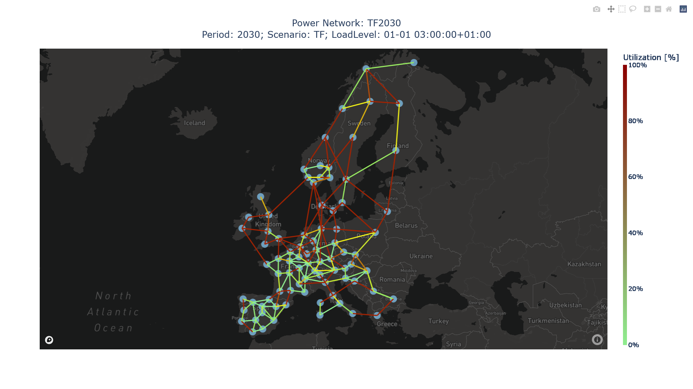

.. image:: https://github.com/IIT-EnergySystemModels/openTEPES/blob/master/doc/img/openTEPES.png
   :target: https://pascua.iit.comillas.edu/aramos/openTEPES/index.html
   :alt: logo
   :align: center

|

.. image:: https://badge.fury.io/py/openTEPES.svg
    :target: https://badge.fury.io/py/openTEPES
    :alt: PyPI

.. image:: https://img.shields.io/pypi/pyversions/openTEPES.svg
   :target: https://pypi.python.org/pypi/openTEPES
   :alt: versions

.. image:: https://img.shields.io/readthedocs/opentepes
   :target: https://opentepes.readthedocs.io/en/latest/index.html
   :alt: docs

.. image:: https://img.shields.io/badge/License-AGPL%20v3-blue.svg
   :target: https://github.com/IIT-EnergySystemModels/openTEPES/blob/master/LICENSE
   :alt: AGPL

.. image:: https://static.pepy.tech/badge/openTEPES
   :target: https://pepy.tech/project/openTEPES
   :alt: pepy

.. image:: https://mybinder.org/badge_logo.svg
  :target: https://mybinder.org/v2/gh/IIT-EnergySystemModels/openTEPES-tutorial/HEAD

**Open Generation, Storage, and Transmission Operation and Expansion Planning Model with RES and ESS (openTEPES)**

*Simplicity and Transparency in Power Systems Planning*

The **openTEPES** model has been developed at the `Instituto de Investigación Tecnológica (IIT) <https://www.iit.comillas.edu/index.php.en>`_ of the `Universidad Pontificia Comillas <https://www.comillas.edu/en/>`_.

The **openTEPES** model presents a decision support system for defining the integrated generation, storage, and transmission expansion plan (GEP+SEP+TEP) of a **large-scale electric system** at a tactical level (i.e., time horizons of 10-20 years),
defined as a set of **generation, storage, and electric and hydrogen networks dynamic investment decisions for multiple future years**.

It is integrated in the `open energy system modelling platform  <https://openenergymodels.net/>`_ helping modelling Europe's energy system.

It has been used by the **Ministry for the Ecological Transition and the Demographic Challenge (MITECO)** to analyze the electricity sector in the latest Spanish `National Energy and Climate Plan (NECP) 2023-2030 <https://energia.gob.es/_layouts/15/HttpHandlerParticipacionPublicaAnexos.ashx?k=64347>`_ in June 2023.

Reference
############
**A. Ramos, E. Quispe, S. Lumbreras** `“OpenTEPES: Open-source Transmission and Generation Expansion Planning” <https://www.sciencedirect.com/science/article/pii/S235271102200053X>`_ SoftwareX 18: June 2022 `10.1016/j.softx.2022.101070 <https://doi.org/10.1016/j.softx.2022.101070>`_.

Description
############
**openTEPES** determines the investment plans of new facilities (generators, ESS, and lines)
for supplying the forecasted demand at minimum cost. Tactical planning is concerned with time horizons of 10-20 years. Its objective is to evaluate the future generation, storage, and network needs.
The main results are the guidelines for the future structure of the generation, storage, and transmission systems.

The **openTEPES** model presents a decision support system for defining the integrated generation, storage, and transmission expansion plan of a large-scale electric system at a tactical level,
defined as a set of generation, storage, and network investment decisions for future years. The expansion candidate, generators, ESS and lines, are pre-defined by the user, so the model determines
the optimal decisions among those specified by the user.

It determines automatically optimal expansion plans that satisfy simultaneously several attributes. Its main characteristics are:

- **Dynamic**: the scope of the model corresponds to several periods (years) at a long-term horizon, 2030 to 2040 for example.

  It represents hierarchically the different time scopes to take decisions in an electric system:

  - Load level: 01-01 00:00:00+01:00 to 12-30 23:00:00+01:00

  The time division allows a user-defined flexible representation of the periods for evaluating the system operation. Additionally, it can be run with chronological periods of several consecutive hours (bi-hourly, tri-hourly resolution)
  to allow decreasing the computational burden without accuracy loss.

- **Stochastic**: several stochastic parameters that can influence the optimal generation, storage, and transmission expansion decisions are considered. The model considers stochastic
  medium-term yearly uncertainties (scenarios) related to the system operation. These operation scenarios are associated with renewable energy sources and electricity demand.

The objective function incorporates the two main quantifiable costs: **generation, storage, and transmission investment cost (CAPEX)** and **expected variable operation costs (including generation emission and reliability costs) (system OPEX)**.

The model formulates a stochastic optimization problem including generation, storage, and network binary investment/retirement decisions, generation operation decisions (commitment, startup and shutdown decisions are also binary) and line switching decisions.
The capacity expansion considers adequacy system reserve margin constraints.

The operation model is a **network constrained unit commitment (NCUC)** based on a **tight and compact** formulation including operating reserves with a
**DC power flow (DCPF)** including **line switching** decisions. Network ohmic losses are considered proportional to the line flow. It considers different **energy storage systems (ESS)**, e.g., pumped-storage hydro,
battery, etc. It allows analyzing the trade-off between the investment in generation/storage/transmission and the investment or use of storage capacity.

The main results of the model can be structured in these topics:

- **Investment**: investment decisions and cost
- **Operation**: unit commitment, startup, and shutdown of non-renewable units, unit output and aggregation by technologies (thermal, storage hydro, pumped-hydro storage, RES), RES curtailment, line flows, line ohmic losses, node voltage angles, upward and downward operating reserves, ESS inventory levels
- **Emissions**: CO2 emissions by unit
- **Marginal**: Locational Short-Run Marginal Costs (LSRMC), water energy value
- **Economic**: operation, emission, and reliability costs and revenues from operation and operating reserves
- **Flexibility**: flexibility provided by demand, by the different generation and consumption technologies, and by power not served

Results are shown in csv files and graphical plots.

A careful implementation has been done to avoid numerical problems by scaling parameters, variables and equations of the optimization problem allowing the model to be used for large-scale cases, e.g., the European system with hourly detail.

Installation
############
There are 2 ways to get all required packages under Windows. We recommend using the Python distribution Miniconda. If you don't want to use it or already have an existing Python (version 3.8 | 3.9 **recommended**, 2.7 is supported as well) installation, you can also download the required packages by yourself.

Miniconda (recommended)
=======================
1. `Miniconda <https://docs.conda.io/en/latest/miniconda.html>`_. Choose the 64-bit installer if possible.

   1. During the installation procedure, keep both checkboxes "modify the PATH" and "register Python" selected! If only higher Python versions are available, you can switch to a specific Python Version by typing ``conda install python=<version>``
   2. **Remark:** if Anaconda or Miniconda was installed previously, please check that python is registered in the environment variables.
2. **Packages and Solver**:

   1. Launch a new command prompt (Windows: Win+R, type "cmd", Enter)
   2. Install `CBC solver <https://github.com/coin-or/Cbc>`_ via `Conda <https://anaconda.org/conda-forge/coincbc>`_ by ``conda install -c conda-forge coincbc``. If you have any problem about the installation, you can also follow the steps that are shown in this `link <https://coin-or.github.io/user_introduction.html>`_.
   3. Install openTEPES via pip by ``pip install openTEPES``

Continue at `Get Started <#get-started>`_ and see the `Tips <#tips>`_.

GitHub Repository (the hard way)
================================
1. Clone the `openTEPES <https://github.com/IIT-EnergySystemModels/openTEPES/tree/master>`_ repository.
2. Launch the command prompt (Windows: Win+R, type "cmd", Enter), or the Anaconda prompt
3. Set up the path by ``cd "C:\Users\<username>\...\openTEPES"``. (Note that the path is where the repository was cloned.)
4. Install openTEPES via pip by ``pip install .``

Solvers
#######

GLPK
=====
As an easy option for installation, we have the free and open-source `GLPK solver <https://www.gnu.org/software/glpk/>`_. However, it takes too much time for large-scale problems. It can be installed using: ``conda install -c conda-forge glpk``.

CBC
=====
The `CBC solver <https://github.com/coin-or/Cbc>`_ is our recommendation if you want a free and open-source solver. For Windows users, the effective way to install the CBC solver is downloading the binaries from `this link <https://www.coin-or.org/download/binary/Cbc/Cbc-2.10.5-x86_64-w64-mingw32.zip>`_, copy and paste the *cbc.exe* file to the PATH that is the "bin" directory of the Anaconda or Miniconda environment. It can be installed using: ``conda install -c conda-forge coincbc``.

Gurobi
======
Another recommendation is the use of `Gurobi solver <https://www.gurobi.com/>`_. However, it is commercial solver but most powerful than GLPK and CBC for large-scale problems.
As a commercial solver it needs a license that is free of charge for academic usage by signing up in `Gurobi webpage <https://pages.gurobi.com/registration/>`_.
It can be installed using: ``conda install -c gurobi gurobi`` and then ask for an academic or commercial license. Activate the license in your computer using the ``grbgetkey`` command (you need to be in the university domain if you are installing an academic license).

Mosek
=====
Another alternative is the `Mosek solver <https://www.mosek.com/>`_. Note that it is a commercial solver and you need a license for it. Mosek is a good alternative to deal with QPs, SOCPs, and SDPs problems. You only need to use ``conda install -c mosek mosek`` for installation and request a license (academic or commercial).
To request the academic one, you can request `here <https://www.mosek.com/products/academic-licenses/>`_. Moreover, Mosek brings a `license guide <https://docs.mosek.com/9.2/licensing/index.html>`_. But if you are request an academic license, you will receive the license by email, and you only need to locate it in the following path ``C:\Users\(your user)\mosek`` in your computer.

GAMS
=====
The model openTEPES can also be solved with `GAMS <https://www.gams.com/>`_ and a valid `GAMS license <https://www.gams.com/buy_gams/>`_ for a solver. The GAMS language is not included in the openTEPES package and must be installed separately.
This option is activated by calling the openTEPES model with the solver name 'gams'.

Get started
###########

Developers
==========
By cloning the `openTEPES <https://github.com/IIT-EnergySystemModels/openTEPES/tree/master>`_ repository, you can create branches and propose pull-request. Any help will be very appreciated.

Continue like the users for a simple way of executions.

Users
=====

If you are not planning on developing, please follows the instructions of the `Installation <#installation>`_.

Once installation is complete, `openTEPES <https://github.com/IIT-EnergySystemModels/openTEPES/tree/master>`_ can be executed in a test mode by using a command prompt.
In the directory of your choice, open and execute the openTEPES_run.py script by using the following on the command prompt (Windows) or Terminal (Linux). (Depending on what your standard python version is, you might need to call `python3` instead of `python`.):

     ``openTEPES_Main``

Then, four parameters (case, dir, solver, and console log) will be asked for.

**Remark:** at this step only press enter for each input and openTEPES will be executed with the default parameters.

After this in a directory of your choice, make a copy of the `9n <https://github.com/IIT-EnergySystemModels/openTEPES/tree/master/openTEPES/9n>`_ or `sSEP <https://github.com/IIT-EnergySystemModels/openTEPES/tree/master/openTEPES/sSEP>`_ case to create a new case of your choice but using the current format of the CSV files.
A proper execution by ``openTEPES_Main`` can be made by introducing the new case and the directory of your choice. Note that the solver is **glpk** by default, but it can be changed by other solvers that pyomo supports (e.g., gurobi, mosek).

Then, the **results** should be written in the folder who is called with the case name. The results contain plots and summary spreadsheets for multiple optimised energy scenarios, periods and load levels as well as the investment decisions.

**Note that** there is an alternative way to run the model by creating a new script **script.py**, and write the following:

    ``from openTEPES.openTEPES import openTEPES_run``

    ``openTEPES_run(<case>, <dir>, <solver>)``

Tips
####

1. A complete documentation of the openTEPES model can be found at `<https://opentepes.readthedocs.io/en/latest/index.html>`_, which presents the mathematical formulation, input data and output results.
2. Try modifying the **TimeStep** in **oT_Data_Parameter_<case>.csv** and see their effect on results.
3. Using **0** or **1**, the optimization options can be activated or deactivated in **oT_Data_Option_<case>.csv**.
4. If you need a nice python editor, think about using `PyCharm <https://www.jetbrains.com/pycharm/download>`_. It has many features including project management, etc.
5. We also suggest the use of `Gurobi <https://www.gurobi.com/academia/academic-program-and-licenses/>`_ (for Academics and Researchers) as a solver to deal with MIP and LP problems instead of GLPK.

Run the Tutorial
################

It can be run in Binder: 

.. image:: https://mybinder.org/badge_logo.svg
  :target: https://mybinder.org/v2/gh/IIT-EnergySystemModels/openTEPES-tutorial/HEAD

Expected Results
################

