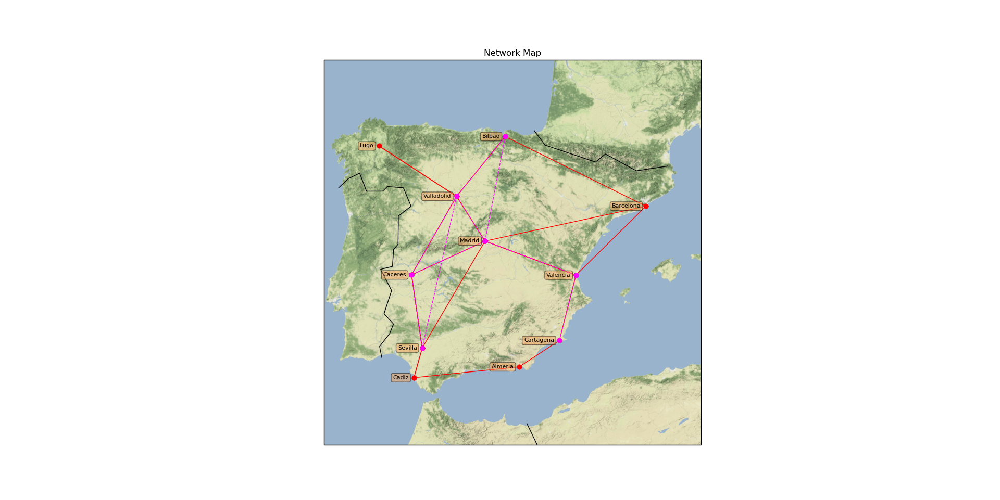
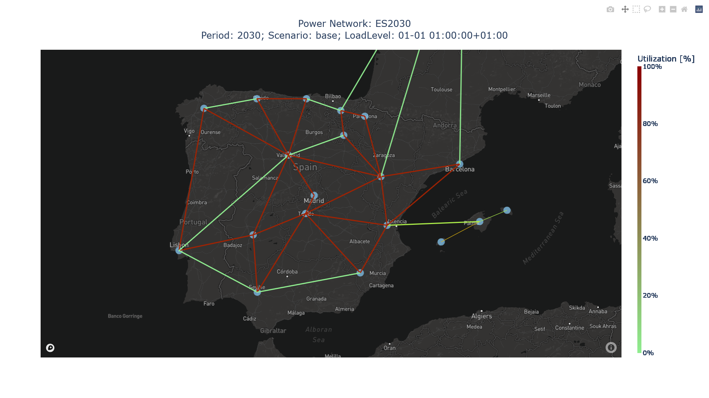
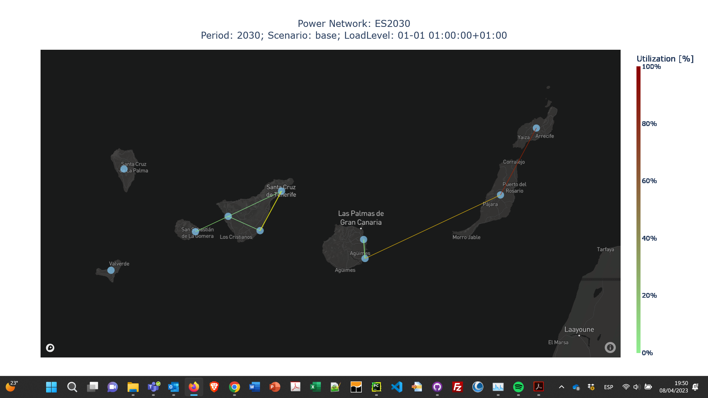
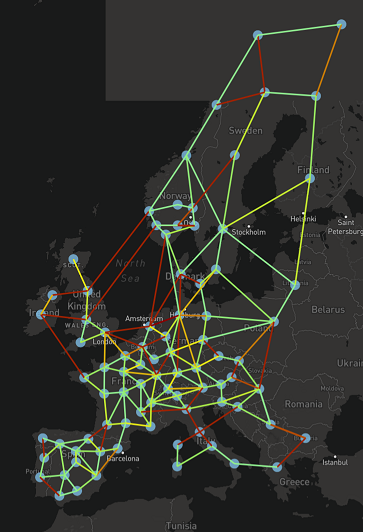
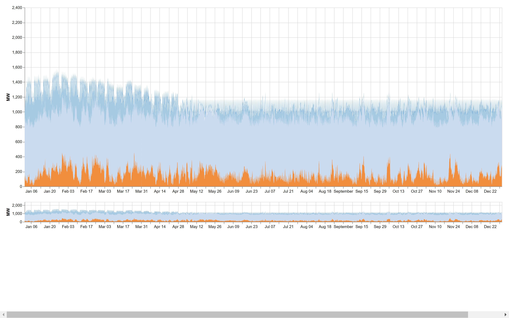
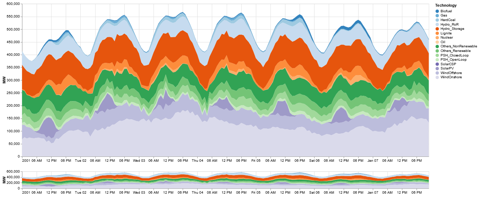

.. openTEPES documentation master file, created by Andres Ramos

Output Results
==============

Some maps of the electricity transmission network and the energy share of different technologies is plotted.

.. image:: ../img/oT_Map_Network_TF2030.png
   :scale: 40%
   :align: center

.. image:: ../img/oT_Plot_TechnologyEnergy_ES_MAF2030.png
   :scale: 6%
   :align: center

Some other additional plots are also plotted by the model. The CSV files used for outputting the results are briefly described in the following items.

Investment/Retirement
---------------------

File ``oT_Result_GenerationInvestment.csv``

============  ==========  ============================
Identifier    Header      Description
============  ==========  ============================
Generator     MW          Generation investment power
============  ==========  ============================

File ``oT_Result_GenerationInvestmentPerUnit.csv``

============  ==========  ============================
Identifier    Header      Description
============  ==========  ============================
Generator     MW          Generation investment power
============  ==========  ============================

File ``oT_Result_GenerationRetirement.csv``

============  ==========  =============================
Identifier    Header      Description
============  ==========  =============================
Generator     MW          Generation retirement power
============  ==========  =============================

File ``oT_Result_TechnologyInvestment.csv``

============  ==========  ============================
Identifier    Header      Description
============  ==========  ============================
Generator     MW          Technology investment power
============  ==========  ============================

File ``oT_Result_TechnologyInvestmentCost.csv``

============  ==========  ============================
Identifier    Header      Description
============  ==========  ============================
Generator     MEUR        Technology investment cost
============  ==========  ============================

File ``oT_Result_TechnologyInvestmentCostPerMW.csv``

============  ==========  ==================================
Identifier    Header      Description
============  ==========  ==================================
Generator     MEUR/MW     Technology investment cost per MW
============  ==========  ==================================

File ``oT_Result_TechnologyRetirement.csv``

============  ==========  ============================
Identifier    Header      Description
============  ==========  ============================
Generator     MW          Technology retirement power
============  ==========  ============================

File ``oT_Result_NetworkInvestment.csv``

============  ==========  ==========  ======  =======================================
Identifier    Identifier  Identifier  Header  Description
============  ==========  ==========  ======  =======================================
Initial node  Final node  Circuit     p.u.    Electricity network investment decision
============  ==========  ==========  ======  =======================================

File ``oT_Result_NetworkInvestment_MWkm.csv``

============  ==========  ==========  ======  ==============================
Identifier    Identifier  Identifier  Header  Description
============  ==========  ==========  ======  ==============================
Initial node  Final node  Circuit     MW-km   Electricity network investment
============  ==========  ==========  ======  ==============================

File ``oT_Result_ReserveMarginPower.csv``

============  ============  ==========  ============================
Identifier    Identifier    Header      Description
============  ============  ==========  ============================
Period        Scenario      GW          Reserve margin
============  ============  ==========  ============================

File ``oT_Result_ReserveMarginPerUnit.csv``

============  ============  ==========  ============================
Identifier    Identifier    Header      Description
============  ============  ==========  ============================
Period        Scenario      p.u.        Per unit reserve margin
============  ============  ==========  ============================

File ``oT_Result_LargestUnitPerUnit.csv``

============  ============  ==========  ============================
Identifier    Identifier    Header      Description
============  ============  ==========  ============================
Period        Scenario      p.u.        Per unit largest unit
============  ============  ==========  ============================

Generation operation
--------------------

File ``oT_Result_GenerationCommitment.csv``

============  ==========  ==========  ==========  ===========================
Identifier    Identifier  Identifier  Header      Description
============  ==========  ==========  ==========  ===========================
Period        Scenario    Load level  Generator   Commitment decision [p.u.]
============  ==========  ==========  ==========  ===========================

File ``oT_Result_GenerationStartUp.csv``

============  ==========  ==========  ==========  ===========================
Identifier    Identifier  Identifier  Header      Description
============  ==========  ==========  ==========  ===========================
Period        Scenario    Load level  Generator   Startup decision [p.u.]
============  ==========  ==========  ==========  ===========================

File ``oT_Result_GenerationShutDown.csv``

============  ==========  ==========  ==========  ==========================
Identifier    Identifier  Identifier  Header      Description
============  ==========  ==========  ==========  ==========================
Period        Scenario    Load level  Generator   Shutdown decision [p.u.]
============  ==========  ==========  ==========  ==========================

File ``oT_Result_GenerationReserveUp.csv``

============  ==========  ==========  ==========  ===============================================
Identifier    Identifier  Identifier  Header      Description
============  ==========  ==========  ==========  ===============================================
Period        Scenario    Load level  Generator   Upward operating reserve of each generator [MW]
============  ==========  ==========  ==========  ===============================================

File ``oT_Result_GenerationReserveDown.csv``

============  ==========  ==========  ==========  =================================================
Identifier    Identifier  Identifier  Header      Description
============  ==========  ==========  ==========  =================================================
Period        Scenario    Load level  Generator   Downward operating reserve of each generator [MW]
============  ==========  ==========  ==========  =================================================

File ``oT_Result_Generation.csv``

============  ==========  ==========  ==========  ===================================
Identifier    Identifier  Identifier  Header      Description
============  ==========  ==========  ==========  ===================================
Period        Scenario    Load level  Generator   Output (discharge in ESS) [MW]
============  ==========  ==========  ==========  ===================================

File ``oT_Result_NetDemand.csv``

============  ==========  ==========  ===================================
Identifier    Identifier  Identifier  Description
============  ==========  ==========  ===================================
Period        Scenario    Load level  Net demand (demand - VRE) [MW]
============  ==========  ==========  ===================================

File ``oT_Result_GenerationSurplus.csv``

============  ==========  ==========  ==============  ===============================
Identifier    Identifier  Identifier  Header          Description
============  ==========  ==========  ==============  ===============================
Period        Scenario    Load level  Generator       Power surplus [MW]
============  ==========  ==========  ==============  ===============================

File ``oT_Result_GenerationRampUpSurplus.csv``

============  ==========  ==========  ==============  ===============================
Identifier    Identifier  Identifier  Header          Description
============  ==========  ==========  ==============  ===============================
Period        Scenario    Load level  Generator       Upward ramp surplus [MW]
============  ==========  ==========  ==============  ===============================

File ``oT_Result_GenerationRampDwSurplus.csv``

============  ==========  ==========  ==============  ===============================
Identifier    Identifier  Identifier  Header          Description
============  ==========  ==========  ==============  ===============================
Period        Scenario    Load level  Generator       Downward ramp surplus [MW]
============  ==========  ==========  ==============  ===============================

File ``oT_Result_GenerationCurtailmentOutput.csv``

============  ==========  ==========  ==============  ===============================
Identifier    Identifier  Identifier  Header          Description
============  ==========  ==========  ==============  ===============================
Period        Scenario    Load level  VRES Generator  Curtailed power of VRES [MW]
============  ==========  ==========  ==============  ===============================

File ``oT_Result_GenerationCurtailmentEnergy.csv``

============  ==========  ==========  ==============  ===============================
Identifier    Identifier  Identifier  Header          Description
============  ==========  ==========  ==============  ===============================
Period        Scenario    Load level  VRES Generator  Curtailed energy of VRES [GWh]
============  ==========  ==========  ==============  ===============================

File ``oT_Result_GenerationCurtailmentEnergyRelative.csv``

============  ==========  ==========  ==============  ===========================================
Identifier    Identifier  Identifier  Header          Description
============  ==========  ==========  ==============  ===========================================
Period        Scenario    Load level  VRES Generator  Percentage of energy curtailed of VRES [%]
============  ==========  ==========  ==============  ===========================================

File ``oT_Result_GenerationEnergy.csv``

============  ==========  ==========  ==========  =================================
Identifier    Identifier  Identifier  Header      Description
============  ==========  ==========  ==========  =================================
Period        Scenario    Load level  Generator   Energy (discharge in ESS) [GWh]
============  ==========  ==========  ==========  =================================

File ``oT_Result_GenerationEmission.csv``

============  ==========  ==========  ==========  =================================
Identifier    Identifier  Identifier  Header      Description
============  ==========  ==========  ==========  =================================
Period        Scenario    Load level  Generator   CO2 emission [MtCO2]
============  ==========  ==========  ==========  =================================

File ``oT_Result_GenerationIncrementalEmission.csv``

============  ==========  ==========  ==============  ===============================================================================================
Identifier    Identifier  Identifier  Header          Description
============  ==========  ==========  ==============  ===============================================================================================
Period        Scenario    Load level  Generator       Emission rate of the generators with power surplus, except the ESS [tCO2/MWh]
============  ==========  ==========  ==============  ===============================================================================================

File ``oT_Result_TechnologyGeneration.csv``

============  ==========  ==========  ==========  =================================
Identifier    Identifier  Identifier  Header      Description
============  ==========  ==========  ==========  =================================
Period        Scenario    Load level  Technology  Output (discharge in ESS) [MW]
============  ==========  ==========  ==========  =================================

File ``oT_Result_TechnologyConsumption.csv``

============  ==========  ==========  ==========  =================================
Identifier    Identifier  Identifier  Header      Description
============  ==========  ==========  ==========  =================================
Period        Scenario    Load level  Technology  Consumption (charge in ESS) [MW]
============  ==========  ==========  ==========  =================================

File ``oT_Result_TechnologyGenerationEnergy.csv``

============  ==========  ==========  ==========  =================================
Identifier    Identifier  Identifier  Header      Description
============  ==========  ==========  ==========  =================================
Period        Scenario    Load level  Technology  Energy (discharge in ESS) [GWh]
============  ==========  ==========  ==========  =================================

File ``oT_Result_TechnologyGenerationEnergy_AreaName.csv``

============  ==========  ==========  ==========  ==========================================
Identifier    Identifier  Identifier  Header      Description
============  ==========  ==========  ==========  ==========================================
Period        Scenario    Load level  Technology  Energy (discharge in ESS) per area [GWh]
============  ==========  ==========  ==========  ==========================================

File ``oT_Result_TechnologyCurtailmentEnergy.csv``

============  ==========  ==========  ==========  ==========================================
Identifier    Identifier  Identifier  Header      Description
============  ==========  ==========  ==========  ==========================================
Period        Scenario    Load level  Technology  Curtailed energy of VRES [GWh]
============  ==========  ==========  ==========  ==========================================

File ``oT_Result_TechnologyCurtailmentEnergyRelative.csv``

============  ==========  ==========  ==============  ===========================================
Identifier    Identifier  Identifier  Header          Description
============  ==========  ==========  ==============  ===========================================
Period        Scenario    Load level  Technology      Percentage of energy curtailed of VRES [%]
============  ==========  ==========  ==============  ===========================================

File ``oT_Result_TechnologyEmission.csv``

============  ==========  ==========  ==========  =================================
Identifier    Identifier  Identifier  Header      Description
============  ==========  ==========  ==========  =================================
Period        Scenario    Load level  Technology   CO2 emission [MtCO2]
============  ==========  ==========  ==========  =================================

File ``oT_Result_TechnologyEmission_AreaName.csv``

============  ==========  ==========  ==========  =================================
Identifier    Identifier  Identifier  Header      Description
============  ==========  ==========  ==========  =================================
Period        Scenario    Load level  Technology   CO2 emission per area [MtCO2]
============  ==========  ==========  ==========  =================================

File ``oT_Result_TechnologyOperatingReserveUp.csv``

============  ==========  ==========  ==========  ==========================================
Identifier    Identifier  Identifier  Header      Description
============  ==========  ==========  ==========  ==========================================
Period        Scenario    Load level  Technology  Upward operating reserve [MW]
============  ==========  ==========  ==========  ==========================================

File ``oT_Result_TechnologyOperatingReserveDown.csv``

============  ==========  ==========  ==========  ==========================================
Identifier    Identifier  Identifier  Header      Description
============  ==========  ==========  ==========  ==========================================
Period        Scenario    Load level  Technology  Downward operating reserve [MW]
============  ==========  ==========  ==========  ==========================================

File ``oT_Result_TechnologySpillage.csv``

============  ==========  ==========  ==========  ==========================================
Identifier    Identifier  Identifier  Header      Description
============  ==========  ==========  ==========  ==========================================
Period        Scenario    Load level  Technology  Spilled energy [GWh]
============  ==========  ==========  ==========  ==========================================

File ``oT_Result_TechnologySpillageRelative.csv``

============  ==========  ==========  ==========  ==========================================
Identifier    Identifier  Identifier  Header      Description
============  ==========  ==========  ==========  ==========================================
Period        Scenario    Load level  Technology  Spilled energy in ESS wrt the inflows [%]
============  ==========  ==========  ==========  ==========================================

ESS operation
-------------

File ``oT_Result_Consumption.csv``

============  ==========  ==========  ==========  ==========================================
Identifier    Identifier  Identifier  Header      Description
============  ==========  ==========  ==========  ==========================================
Period        Scenario    Load level  Generator   Consumed/charged power in ESS [MW]
============  ==========  ==========  ==========  ==========================================

File ``oT_Result_ConsumptionEnergy.csv``

============  ==========  ==========  ==========  ==========================================
Identifier    Identifier  Identifier  Header      Description
============  ==========  ==========  ==========  ==========================================
Period        Scenario    Load level  Generator   Consumed/charged energy in ESS [GWh]
============  ==========  ==========  ==========  ==========================================

File ``oT_Result_ConsumptionReserveUp.csv``

============  ==========  ==========  ==========  =================================================
Identifier    Identifier  Identifier  Header      Description
============  ==========  ==========  ==========  =================================================
Period        Scenario    Load level  Generator   Upward operating reserve of each pump/charge [MW]
============  ==========  ==========  ==========  =================================================

File ``oT_Result_ConsumptionReserveDown.csv``

============  ==========  ==========  ==========  ===================================================
Identifier    Identifier  Identifier  Header      Description
============  ==========  ==========  ==========  ===================================================
Period        Scenario    Load level  Generator   Downward operating reserve of each pump/charge [MW]
============  ==========  ==========  ==========  ===================================================

File ``oT_Result_GenerationOutflows.csv``

============  ==========  ==========  ==========  ==========================================
Identifier    Identifier  Identifier  Header      Description
============  ==========  ==========  ==========  ==========================================
Period        Scenario    Load level  Generator   Outflows power in ESS [MW]
============  ==========  ==========  ==========  ==========================================

File ``oT_Result_GenerationOutflowsEnergy.csv``

============  ==========  ==========  ==========  ==========================================
Identifier    Identifier  Identifier  Header      Description
============  ==========  ==========  ==========  ==========================================
Period        Scenario    Load level  Generator   Outflows energy in ESS [GWh]
============  ==========  ==========  ==========  ==========================================

File ``oT_Result_TechnologyConsumption.csv``

============  ==========  ==========  ==========  ==========================================
Identifier    Identifier  Identifier  Header      Description
============  ==========  ==========  ==========  ==========================================
Period        Scenario    Load level  Technology  Charged power in ESS [MW]
============  ==========  ==========  ==========  ==========================================

File ``oT_Result_TechnologyConsumptionEnergy.csv``

============  ==========  ==========  ==========  ==========================================
Identifier    Identifier  Identifier  Header      Description
============  ==========  ==========  ==========  ==========================================
Period        Scenario    Load level  Technology  Energy (charge in ESS) [GWh]
============  ==========  ==========  ==========  ==========================================

File ``oT_Result_TechnologyConsumptionEnergy_AreaName.csv``

============  ==========  ==========  ==========  ==========================================
Identifier    Identifier  Identifier  Header      Description
============  ==========  ==========  ==========  ==========================================
Period        Scenario    Load level  Technology  Energy (charge in ESS) per area [GWh]
============  ==========  ==========  ==========  ==========================================

File ``oT_Result_TechnologyOutflows.csv``

============  ==========  ==========  ==========  ==========================================
Identifier    Identifier  Identifier  Header      Description
============  ==========  ==========  ==========  ==========================================
Period        Scenario    Load level  Technology  Outflows power in ESS [MW]
============  ==========  ==========  ==========  ==========================================

File ``oT_Result_TechnologyOutflowsEnergy.csv``

============  ==========  ==========  ==========  ==========================================
Identifier    Identifier  Identifier  Header      Description
============  ==========  ==========  ==========  ==========================================
Period        Scenario    Load level  Technology  Energy (Outflows in ESS) [GWh]
============  ==========  ==========  ==========  ==========================================

File ``oT_Result_TechnologyOperatingReserveUpESS.csv``

============  ==========  ==========  ==========  ==========================================
Identifier    Identifier  Identifier  Header      Description
============  ==========  ==========  ==========  ==========================================
Period        Scenario    Load level  Technology  Upward operating reserve [MW]
============  ==========  ==========  ==========  ==========================================

File ``oT_Result_TechnologyOperatingReserveDownESS.csv``

============  ==========  ==========  ==========  ==========================================
Identifier    Identifier  Identifier  Header      Description
============  ==========  ==========  ==========  ==========================================
Period        Scenario    Load level  Technology  Downward operating reserve [MW]
============  ==========  ==========  ==========  ==========================================

File ``oT_Result_GenerationInventory.csv``

============  ==========  ==========  =========  ==============================================================================================
Identifier    Identifier  Identifier  Header     Description
============  ==========  ==========  =========  ==============================================================================================
Period        Scenario    Load level  Generator  Stored energy (SoC in batteries, reservoir energy in pumped-hydro storage power plants) [GWh]
============  ==========  ==========  =========  ==============================================================================================

File ``oT_Result_GenerationInventoryUtilization.csv``

============  ==========  ==========  =========  ===================================================================================================================
Identifier    Identifier  Identifier  Header     Description
============  ==========  ==========  =========  ===================================================================================================================
Period        Scenario    Load level  Generator  Utilization factor of the storage (SoC in batteries, reservoir energy in pumped-hydro storage power plants) [p.u.]
============  ==========  ==========  =========  ===================================================================================================================

File ``oT_Result_GenerationSpillage.csv``

============  ==========  ==========  ==========  ==========================================
Identifier    Identifier  Identifier  Header      Description
============  ==========  ==========  ==========  ==========================================
Period        Scenario    Load level  Generator   Spilled energy in ESS [GWh]
============  ==========  ==========  ==========  ==========================================

File ``oT_Result_GenerationSpillageRelative.csv``

============  ==========  ==========  ==========  ==========================================
Identifier    Identifier  Identifier  Header      Description
============  ==========  ==========  ==========  ==========================================
Period        Scenario    Load level  Generator   Spilled energy in ESS wrt the inflows [%]
============  ==========  ==========  ==========  ==========================================

File ``oT_Result_SummaryGeneration.csv``

============  ==========  ==========  ============  ==============================================
Identifier    Identifier  Identifier  Identifier    Description
============  ==========  ==========  ============  ==============================================
Period        Scenario    Load level  Generator     Generation output (to be used as pivot table)
============  ==========  ==========  ============  ==============================================

Reservoir operation
-------------------

File ``oT_Result_ReservoirVolume.csv``

============  ==========  ==========  =========  =================================
Identifier    Identifier  Identifier  Header     Description
============  ==========  ==========  =========  =================================
Period        Scenario    Load level  Reservoir  Reservoir volume [hm\ :sup:`3`]
============  ==========  ==========  =========  =================================

File ``oT_Result_ReservoirVolumeUtilization.csv``

============  ==========  ==========  =========  ============================================
Identifier    Identifier  Identifier  Header     Description
============  ==========  ==========  =========  ============================================
Period        Scenario    Load level  Reservoir  Utilization factor of the reservoir [p.u.]
============  ==========  ==========  =========  ============================================

File ``oT_Result_ReservoirSpillage.csv``

============  ==========  ==========  ==========  ==========================================
Identifier    Identifier  Identifier  Header      Description
============  ==========  ==========  ==========  ==========================================
Period        Scenario    Load level  Reservoir   Spilled water in reservoir [hm\ :sup:`3`]
============  ==========  ==========  ==========  ==========================================

File ``oT_Result_TechnologyOperatingReservoirSpillage.csv``

============  ==========  ==========  ==========  =========================================================
Identifier    Identifier  Identifier  Header      Description
============  ==========  ==========  ==========  =========================================================
Period        Scenario    Load level  Reservoir   Spilled water in reservoir by technology [hm\ :sup:`3`]
============  ==========  ==========  ==========  =========================================================

File ``oT_Result_MarginalWaterVolumeValue.csv``

============  ==========  ==========  ==========  ================================================
Identifier    Identifier  Identifier  Header      Description
============  ==========  ==========  ==========  ================================================
Period        Scenario    Load level  Reservoir   Water volume value [€/dam\ :sup:`3`]
============  ==========  ==========  ==========  ================================================

Electricity balance
-------------------

File ``oT_Result_BalanceEnergy.csv``

============  ==========  ==========  ==========  =======================================================
Identifier    Identifier  Identifier  Identifier  Description
============  ==========  ==========  ==========  =======================================================
Period        Scenario    Load level  Technology  Generation, consumption, flows, losses and demand [GWh]
============  ==========  ==========  ==========  =======================================================

File ``oT_Result_BalanceEnergyPerArea.csv``

============  ==========  ==========  ==========  ==========  =======================================================
Identifier    Identifier  Identifier  Identifier  Header      Description
============  ==========  ==========  ==========  ==========  =======================================================
Period        Scenario    Load level  Technology  Area        Generation, consumption, flows, losses and demand [GWh]
============  ==========  ==========  ==========  ==========  =======================================================

File ``oT_Result_BalanceEnergyPerNode.csv``

============  ==========  ==========  ==========  ==========  =======================================================
Identifier    Identifier  Identifier  Identifier  Header      Description
============  ==========  ==========  ==========  ==========  =======================================================
Period        Scenario    Load level  Technology  Node        Generation, consumption, flows, losses and demand [GWh]
============  ==========  ==========  ==========  ==========  =======================================================

File ``oT_Result_BalanceEnergyPerTech.csv``

============  ==========  ==========  ==========  ==========  ==========  =======================================================
Identifier    Identifier  Identifier  Identifier  Identifier  Header      Description
============  ==========  ==========  ==========  ==========  ==========  =======================================================
Period        Scenario    Load level  Area        Node        Technology  Generation, consumption, flows, losses and demand [GWh]
============  ==========  ==========  ==========  ==========  ==========  =======================================================

Electricity network operation
-----------------------------

File ``oT_Result_NetworkCommitment.csv``

============  ==========  ==========  ============  ==========  =========  ================================
Identifier    Identifier  Identifier  Header        Header      Header     Description
============  ==========  ==========  ============  ==========  =========  ================================
Period        Scenario    Load level  Initial node  Final node  Circuit    Line commitment decision [p.u.]
============  ==========  ==========  ============  ==========  =========  ================================

File ``oT_Result_NetworkSwitchOn.csv``

============  ==========  ==========  ============  ==========  =========  ================================
Identifier    Identifier  Identifier  Header        Header      Header     Description
============  ==========  ==========  ============  ==========  =========  ================================
Period        Scenario    Load level  Initial node  Final node  Circuit    Line switch on decision [p.u.]
============  ==========  ==========  ============  ==========  =========  ================================

File ``oT_Result_NetworkSwitchOff.csv``

============  ==========  ==========  ============  ==========  =========  ================================
Identifier    Identifier  Identifier  Header        Header      Header     Description
============  ==========  ==========  ============  ==========  =========  ================================
Period        Scenario    Load level  Initial node  Final node  Circuit    Line switch off decision [p.u.]
============  ==========  ==========  ============  ==========  =========  ================================

File ``oT_Result_NetworkFlowPerNode.csv``

============  ==========  ==========  ============  ==========  =========  =======================
Identifier    Identifier  Identifier  Header        Header      Header     Description
============  ==========  ==========  ============  ==========  =========  =======================
Period        Scenario    Load level  Initial node  Final node  Circuit    Line flow [MW]
============  ==========  ==========  ============  ==========  =========  =======================

File ``oT_Result_NetworkEnergyPerArea.csv``

============  ==========  ==========  ============  ==========  =======================
Identifier    Identifier  Identifier  Header        Header      Description
============  ==========  ==========  ============  ==========  =======================
Period        Scenario    Load level  Initial area  Final area  Area flow energy [GWh]
============  ==========  ==========  ============  ==========  =======================

File ``oT_Result_NetworkEnergyTotalPerArea.csv``

============  ==========  ============  ==========  =======================
Identifier    Identifier  Header        Header      Description
============  ==========  ============  ==========  =======================
Period        Scenario    Initial area  Final area  Area flow energy [GWh]
============  ==========  ============  ==========  =======================

File ``oT_Result_NetworkEnergyTransport.csv``

============  ==========  ==========  ============  ==========  =========  ============================
Identifier    Identifier  Identifier  Header        Header      Header     Description
============  ==========  ==========  ============  ==========  =========  ============================
Period        Scenario    Load level  Initial node  Final node  Circuit    Energy transported [GWh-Mkm]
============  ==========  ==========  ============  ==========  =========  ============================

File ``oT_Result_NetworkUtilization.csv``

============  ==========  ==========  ============  ==========  ==========  ================================================================
Identifier    Identifier  Identifier  Header        Header      Header      Description
============  ==========  ==========  ============  ==========  ==========  ================================================================
Period        Scenario    Load level  Initial node  Final node  Circuit     Line utilization (i.e., ratio between flow and capacity) [p.u.]
============  ==========  ==========  ============  ==========  ==========  ================================================================

File ``oT_Result_NetworkLosses.csv``

============  ==========  ==========  ============  ==========  ==========  =======================
Identifier    Identifier  Identifier  Header        Header      Header      Description
============  ==========  ==========  ============  ==========  ==========  =======================
Period        Scenario    Load level  Initial node  Final node  Circuit     Line losses [MW]
============  ==========  ==========  ============  ==========  ==========  =======================

File ``oT_Result_NetworkAngle.csv``

============  ==========  ==========  =========  =======================
Identifier    Identifier  Identifier  Header     Description
============  ==========  ==========  =========  =======================
Period        Scenario    Load level  Node       Voltage angle [rad]
============  ==========  ==========  =========  =======================

File ``oT_Result_NetworkNetDemand.csv``

============  ==========  ==========  ==========  ===========================================
Identifier    Identifier  Identifier  Header      Description
============  ==========  ==========  ==========  ===========================================
Period        Scenario    Load level  Node        Electricity net demand (demand - VRE) [MW]
============  ==========  ==========  ==========  ===========================================

File ``oT_Result_NetworkPNS.csv``

============  ==========  ==========  ==========  ==========================================
Identifier    Identifier  Identifier  Header      Description
============  ==========  ==========  ==========  ==========================================
Period        Scenario    Load level  Node        Power not served by node [MW]
============  ==========  ==========  ==========  ==========================================

File ``oT_Result_NetworkENS.csv``

============  ==========  ==========  ==========  ==========================================
Identifier    Identifier  Identifier  Header      Description
============  ==========  ==========  ==========  ==========================================
Period        Scenario    Load level  Node        Energy not served by node [GWh]
============  ==========  ==========  ==========  ==========================================

File ``oT_Result_SummaryNetwork.csv``

============  ==========  ==========  ============  ==========  ============================================
Identifier    Identifier  Identifier  Identifier    Identifier  Description
============  ==========  ==========  ============  ==========  ============================================
Period        Scenario    Load level  Initial node  Final node   Network output (to be used as pivot table)
============  ==========  ==========  ============  ==========  ============================================

Hydrogen balance and network operation
--------------------------------------

File ``oT_Result_BalanceHydrogen.csv``

============  ==========  ==========  ==========  ======================================
Identifier    Identifier  Identifier  Identifier  Description
============  ==========  ==========  ==========  ======================================
Period        Scenario    Load level  Technology  Generation, flows, and demand [tH2]
============  ==========  ==========  ==========  ======================================

File ``oT_Result_BalanceHydrogenPerArea.csv``

============  ==========  ==========  ==========  ==========  ======================================
Identifier    Identifier  Identifier  Identifier  Header      Description
============  ==========  ==========  ==========  ==========  ======================================
Period        Scenario    Load level  Technology  Area        Generation, flows, and demand [tH2]
============  ==========  ==========  ==========  ==========  ======================================

File ``oT_Result_BalanceHydrogenPerNode.csv``

============  ==========  ==========  ==========  ==========  ======================================
Identifier    Identifier  Identifier  Identifier  Header      Description
============  ==========  ==========  ==========  ==========  ======================================
Period        Scenario    Load level  Technology  Node        Generation, flows, and demand [tH2]
============  ==========  ==========  ==========  ==========  ======================================

File ``oT_Result_BalanceHydrogenPerTech.csv``

============  ==========  ==========  ==========  ==========  ==========  ======================================
Identifier    Identifier  Identifier  Identifier  Identifier  Header      Description
============  ==========  ==========  ==========  ==========  ==========  ======================================
Period        Scenario    Load level  Area        Node        Technology  Generation, flows, and demand [tH2]
============  ==========  ==========  ==========  ==========  ==========  ======================================

File ``oT_Result_NetworkFlowH2PerNode.csv``

============  ==========  ==========  ============  ==========  =========  =======================
Identifier    Identifier  Identifier  Header        Header      Header     Description
============  ==========  ==========  ============  ==========  =========  =======================
Period        Scenario    Load level  Initial node  Final node  Circuit    Pipeline flow [tH2]
============  ==========  ==========  ============  ==========  =========  =======================

File ``oT_Result_NetworkHNS.csv``

============  ==========  ==========  ==========  ====================================
Identifier    Identifier  Identifier  Header      Description
============  ==========  ==========  ==========  ====================================
Period        Scenario    Load level  Node        Hydrogen not served by node [tH2]
============  ==========  ==========  ==========  ====================================

Costs and revenues
------------------

File ``oT_Result_CostSummary.csv``

============  ==========================================
Identifier    Description
============  ==========================================
Cost type     Type of cost [M€]
============  ==========================================

File ``oT_Result_CostSummary_AreaName.csv``

============  ==========  ==========================================
Identifier    Header      Description
============  ==========  ==========================================
Cost type     Area        Type of cost per area [M€]
============  ==========  ==========================================

File ``oT_Result_CostRecovery.csv``

============  ==========================================
Identifier    Description
============  ==========================================
Cost type     Revenues and investment costs [M€]
============  ==========================================

File ``oT_Result_SummaryKPIs.csv``

============  ===============
Identifier    Description
============  ===============
KPI           Several KPIs
============  ===============

File ``oT_Result_TechnologyLCOE.csv``

==========  ==============================================
Identifier  Description
==========  ==============================================
Technology  Levelized Cost of Electricity (LCOE) [EUR/MWh]
==========  ==============================================

File ``oT_Result_GenerationCostOandM.csv``

============  ==========  ==========  ==========  ==========================================
Identifier    Identifier  Identifier  Header      Description
============  ==========  ==========  ==========  ==========================================
Period        Scenario    Load level  Generator   O&M cost for the generation [M€]
============  ==========  ==========  ==========  ==========================================

File ``oT_Result_GenerationCostOperation.csv``

============  ==========  ==========  ==========  ==========================================
Identifier    Identifier  Identifier  Header      Description
============  ==========  ==========  ==========  ==========================================
Period        Scenario    Load level  Generator   Operation cost for the generation [M€]
============  ==========  ==========  ==========  ==========================================

File ``oT_Result_ConsumptionCostOperation.csv``

============  ==========  ==========  ==========  ==========================================
Identifier    Identifier  Identifier  Header      Description
============  ==========  ==========  ==========  ==========================================
Period        Scenario    Load level  Pump        Operation cost for the consumption [M€]
============  ==========  ==========  ==========  ==========================================

File ``oT_Result_GenerationCostOperReserve.csv``

============  ==========  ==========  ==========  ==============================================
Identifier    Identifier  Identifier  Header      Description
============  ==========  ==========  ==========  ==============================================
Period        Scenario    Load level  Generator   Operation reserve cost for the generation [M€]
============  ==========  ==========  ==========  ==============================================

File ``oT_Result_ConsumptionCostOperReserve.csv``

============  ==========  ==========  ==========  ===============================================
Identifier    Identifier  Identifier  Header      Description
============  ==========  ==========  ==========  ===============================================
Period        Scenario    Load level  Pump        Operation reserve cost for the consumption [M€]
============  ==========  ==========  ==========  ===============================================

File ``oT_Result_GenerationCostEmission.csv``

============  ==========  ==========  ==========  ==========================================
Identifier    Identifier  Identifier  Header      Description
============  ==========  ==========  ==========  ==========================================
Period        Scenario    Load level  Generator   Emission cost for the generation [M€]
============  ==========  ==========  ==========  ==========================================

File ``oT_Result_NetworkCostENS.csv``

============  ==========  ==========  ==========  ================================================
Identifier    Identifier  Identifier  Header      Description
============  ==========  ==========  ==========  ================================================
Period        Scenario    Load level  Node        Reliability cost (cost of the ENS and HNS) [M€]
============  ==========  ==========  ==========  ================================================

File ``oT_Result_RevenueEnergyGeneration.csv``

============  ==========  ==========  ==========  ==========================================
Identifier    Identifier  Identifier  Header      Description
============  ==========  ==========  ==========  ==========================================
Period        Scenario    Load level  Generator   Operation revenues for the generation [M€]
============  ==========  ==========  ==========  ==========================================

File ``oT_Result_RevenueEnergyConsumption.csv``

============  ==========  ==========  ==============  ==================================================
Identifier    Identifier  Identifier  Header          Description
============  ==========  ==========  ==============  ==================================================
Period        Scenario    Load level  ESS Generator   Operation revenues for the consumption/charge [M€]
============  ==========  ==========  ==============  ==================================================

File ``oT_Result_RevenueOperatingReserveUp.csv``

============  ==========  ==========  ==========  ==========================================================
Identifier    Identifier  Identifier  Header      Description
============  ==========  ==========  ==========  ==========================================================
Period        Scenario    Load level  Generator   Operation revenues from the upward operating reserve [M€]
============  ==========  ==========  ==========  ==========================================================

File ``oT_Result_RevenueOperatingReserveUpESS.csv``

============  ==========  ==========  ==============  ==========================================================
Identifier    Identifier  Identifier  Header          Description
============  ==========  ==========  ==============  ==========================================================
Period        Scenario    Load level  ESS Generator   Operation revenues from the upward operating reserve [M€]
============  ==========  ==========  ==============  ==========================================================

File ``oT_Result_RevenueOperatingReserveDw.csv``

============  ==========  ==========  ==========  ===========================================================
Identifier    Identifier  Identifier  Header      Description
============  ==========  ==========  ==========  ===========================================================
Period        Scenario    Load level  Generator   Operation revenues from the downward operating reserve [M€]
============  ==========  ==========  ==========  ===========================================================

File ``oT_Result_RevenueOperatingReserveDwESS.csv``

============  ==========  ==========  ==============  ===========================================================
Identifier    Identifier  Identifier  Header          Description
============  ==========  ==========  ==============  ===========================================================
Period        Scenario    Load level  ESS Generator   Operation revenues from the downward operating reserve [M€]
============  ==========  ==========  ==============  ===========================================================

Marginal information
--------------------

File ``oT_Result_MarginalReserveMargin.csv``

============  ==========  ==========  =======================================================
Identifier    Identifier  Header      Description
============  ==========  ==========  =======================================================
Period        Scenario    Area        Marginal of the minimum adequacy reserve margin [€/MW]
============  ==========  ==========  =======================================================

File ``oT_Result_MarginalEmission.csv``

============  ==========  ==========  =================================================
Identifier    Identifier  Header      Description
============  ==========  ==========  =================================================
Period        Scenario    Area        Marginal of the maximum CO2 emission [€/tCO2]
============  ==========  ==========  =================================================

File ``oT_Result_MarginalIncrementalVariableCost.csv``

============  ==========  ==========  ==============  ===============================================================================================
Identifier    Identifier  Identifier  Header          Description
============  ==========  ==========  ==============  ===============================================================================================
Period        Scenario    Load level  Generator       Variable cost (fuel+O&M+emission) of the generators with power surplus, except the ESS [€/MWh]
============  ==========  ==========  ==============  ===============================================================================================

File ``oT_Result_MarginalIncrementalGenerator.csv``

============  ==========  ==========  ===================================================================================================
Identifier    Identifier  Identifier  Description
============  ==========  ==========  ===================================================================================================
Period        Scenario    Load level  Generator with power surplus, except the ESS, and with the lowest variable cost (fuel+O&M+emission)
============  ==========  ==========  ===================================================================================================

File ``oT_Result_NetworkSRMC.csv``

============  ==========  ==========  ==========  ==========================================
Identifier    Identifier  Identifier  Header      Description
============  ==========  ==========  ==========  ==========================================
Period        Scenario    Load level  Node        Locational Short-Run Marginal Cost [€/MWh]
============  ==========  ==========  ==========  ==========================================

These marginal costs are obtained after fixing the binary and continuous investment decisions and the binary operation decisions to their optimal values.
Remember that binary decisions are not affected by marginal changes.

File ``oT_Result_MarginalWaterValue.csv``

============  ==========  ==========  ==========  ================================================
Identifier    Identifier  Identifier  Header      Description
============  ==========  ==========  ==========  ================================================
Period        Scenario    Load level  Generator   Energy inflow value [€/MWh]
============  ==========  ==========  ==========  ================================================

File ``oT_Result_MarginalOperatingReserveUp.csv``

============  ==========  ==========  ==========  ================================================
Identifier    Identifier  Identifier  Header      Description
============  ==========  ==========  ==========  ================================================
Period        Scenario    Load level  Area        Marginal of the upward operating reserve [€/MW]
============  ==========  ==========  ==========  ================================================

File ``oT_Result_MarginalOperatingReserveDown.csv``

============  ==========  ==========  ==========  =================================================
Identifier    Identifier  Identifier  Header      Description
============  ==========  ==========  ==========  =================================================
Period        Scenario    Load level  Area        Marginal of the downward operating reserve [€/MW]
============  ==========  ==========  ==========  =================================================

File ``oT_Result_NetworkInvestment_ReducedCost.csv``

============  ==========  ==========  ===========================================================
Identifier    Identifier  Identifier  Description
============  ==========  ==========  ===========================================================
Initial node  Final node  Circuit     Reduced costs of electric network investment decisions [M€]
============  ==========  ==========  ===========================================================

File ``oT_Result_NetworkCommitment_ReducedCost.csv``

============  ==========  ==========  ===========================================================
Identifier    Identifier  Identifier  Description
============  ==========  ==========  ===========================================================
Initial node  Final node  Circuit     Reduced costs of electric network switching decisions [M€]
============  ==========  ==========  ===========================================================

Operational flexibility
-----------------------

File ``oT_Result_FlexibilityDemand.csv``

============  ==========  ==========  ==========  ================================================
Identifier    Identifier  Identifier  Header      Description
============  ==========  ==========  ==========  ================================================
Period        Scenario    Load level  Demand      Demand variation wrt its mean value [MW]
============  ==========  ==========  ==========  ================================================

File ``oT_Result_FlexibilityPNS.csv``

============  ==========  ==========  ==========  ==================================================
Identifier    Identifier  Identifier  Header      Description
============  ==========  ==========  ==========  ==================================================
Period        Scenario    Load level  PNS         Power not served variation wrt its mean value [MW]
============  ==========  ==========  ==========  ==================================================

File ``oT_Result_FlexibilityTechnology.csv``

============  ==========  ==========  ==========  ================================================
Identifier    Identifier  Identifier  Header      Description
============  ==========  ==========  ==========  ================================================
Period        Scenario    Load level  Technology  Technology variation wrt its mean value [MW]
============  ==========  ==========  ==========  ================================================

File ``oT_Result_FlexibilityTechnologyESS.csv``

============  ==========  ==========  ==========  ================================================
Identifier    Identifier  Identifier  Header      Description
============  ==========  ==========  ==========  ================================================
Period        Scenario    Load level  Technology  ESS Technology variation wrt its mean value [MW]
============  ==========  ==========  ==========  ================================================
