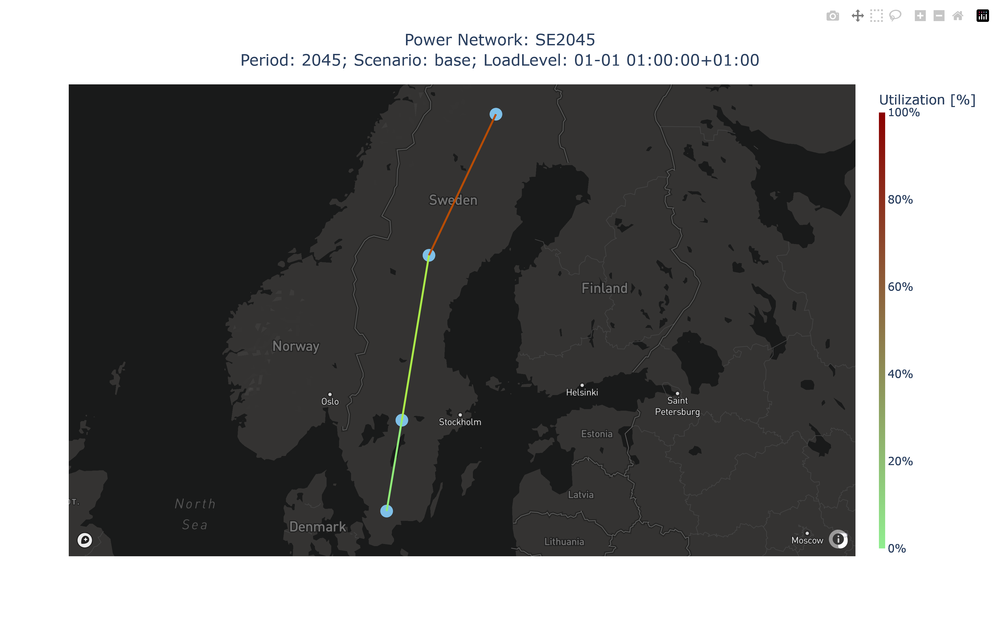
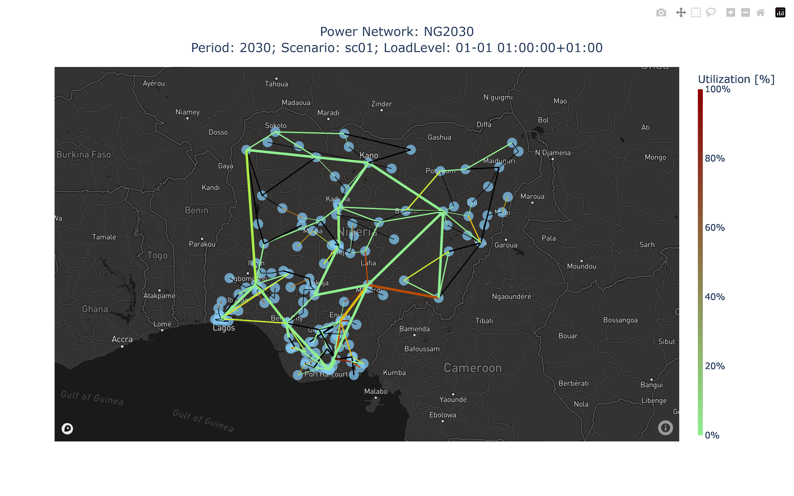

.. openTEPES documentation master file, created by Andres Ramos

Output Results
==============

Some maps of the electricity transmission network and the energy share of different technologies are plotted.

.. image:: ../img/oT_Map_Network_sSEP.png
   :scale: 40%
   :align: center

.. image:: ../img/oT_Plot_MapNetwork_ES2030.png
   :scale: 40%
   :align: center

.. image:: ../img/oT_Plot_MapNetwork_ES2030_CI.png
   :scale: 40%
   :align: center

.. image:: ../img/oT_Map_Network_MAF2030.png
   :scale: 60%
   :align: center

.. image:: ../img/oT_Map_Network_TF2030.png
   :scale: 40%
   :align: center

.. image:: ../img/oT_Plot_TechnologyEnergy_ES_MAF2030.png
   :scale: 6%
   :align: center

.. image:: ../img/oT_Plot_TechnologyOutput_2030_sc01_9n.png
   :scale: 20%
   :align: center

.. image:: ../img/oT_Plot_TechnologyOutput_2030_sc01_MAF.png
   :scale: 55%
   :align: center

Some other additional plots are also plotted by the model. The CSV files used for outputting the results are briefly described in the following items.

The power is expressed in MW, energy or heat in GWh, and costs in M€. Hydrogen is expressed in tH2. Reservoir volume is expressed in hm\ :sup:`3`,
and water flow in hm\ :sup:`3`/s. The energy transported in the electricity network is expressed in GWh-Mkm.

Investment/Retirement
---------------------

File ``oT_Result_GenerationInvestment.csv``

============  ==========  ================================
Identifier    Header      Description
============  ==========  ================================
Period        Generator   Generation investment power [MW]
============  ==========  ================================

File ``oT_Result_GenerationInvestmentPerUnit.csv``

============  ==========  ======================================
Identifier    Header      Description
============  ==========  ======================================
Period        Generator   Generation investment decision [p.u.]
============  ==========  ======================================

File ``oT_Result_GenerationRetirement.csv``

============  ==========  ================================
Identifier    Header      Description
============  ==========  ================================
Period        Generator   Generation retirement power [MW]
============  ==========  ================================

File ``oT_Result_GenerationRetirementPerUnit.csv``

============  ==========  ======================================
Identifier    Header      Description
============  ==========  ======================================
Period        Generator   Generation retirement decision [p.u.]
============  ==========  ======================================

File ``oT_Result_TechnologyInvestment.csv``

============  ==========  =================================
Identifier    Header      Description
============  ==========  =================================
Period        Generator   Technology investment power [MW]
============  ==========  =================================

File ``oT_Result_TechnologyInvestmentCost.csv``

============  ==========  ================================
Identifier    Header      Description
============  ==========  ================================
Period        Generator   Technology investment cost [M€]
============  ==========  ================================

File ``oT_Result_TechnologyInvestmentCostPerMW.csv``

============  ==========  ===========================================
Identifier    Header      Description
============  ==========  ===========================================
Period        Generator   Technology investment cost per MW [M€/MW]
============  ==========  ===========================================

File ``oT_Result_TechnologyRetirement.csv``

============  ==========  =================================
Identifier    Header      Description
============  ==========  =================================
Period        Generator   Technology retirement power [MW]
============  ==========  =================================

File ``oT_Result_NetworkInvestmentPerUnit.csv``

==========  ============  ==========  ==========  ===============================================
Identifier  Header                                Description
==========  ====================================  ===============================================
Period      Initial node  Final node  Circuit     Electricity network investment decision [p.u.]
==========  ============  ==========  ==========  ===============================================

File ``oT_Result_NetworkInvestmentMWkm.csv``

==========  ============  ==========  ==========  ======================================
Identifier  Header                                Description
==========  ====================================  ======================================
Period      Initial node  Final node  Circuit     Electricity network investment [MWkm]
==========  ============  ==========  ==========  ======================================

File ``oT_Result_ReserveMargin.csv``

============  ============  ==========  ============================
Identifier                  Header      Description
==========================  ==========  ============================
Period        Scenario      GW          Reserve margin
============  ============  ==========  ============================

File ``oT_Result_ReserveMarginPerUnit.csv``

============  ============  ==========  ============================
Identifier                  Header      Description
==========================  ==========  ============================
Period        Scenario      p.u.        Per unit reserve margin
============  ============  ==========  ============================

File ``oT_Result_LargestUnitPerUnit.csv``

============  ============  ==========  ============================
Identifier                  Header      Description
==========================  ==========  ============================
Period        Scenario      p.u.        Per unit largest unit
============  ============  ==========  ============================

Electricity generation operation
--------------------------------

File ``oT_Result_GenerationCommitment.csv``

============  ==========  ==========  ==========  ===========================
Identifier                            Header      Description
====================================  ==========  ===========================
Period        Scenario    Load level  Generator   Commitment decision [p.u.]
============  ==========  ==========  ==========  ===========================

File ``oT_Result_GenerationStartUp.csv``

============  ==========  ==========  ==========  ===========================
Identifier                            Header      Description
====================================  ==========  ===========================
Period        Scenario    Load level  Generator   Startup decision [p.u.]
============  ==========  ==========  ==========  ===========================

File ``oT_Result_GenerationShutDown.csv``

============  ==========  ==========  ==========  ==========================
Identifier                            Header      Description
====================================  ==========  ==========================
Period        Scenario    Load level  Generator   Shutdown decision [p.u.]
============  ==========  ==========  ==========  ==========================

File ``oT_Result_GenerationReserveUp.csv``

============  ==========  ==========  ==========  ===============================================
Identifier                            Header      Description
====================================  ==========  ===============================================
Period        Scenario    Load level  Generator   Upward operating reserve of each generator [MW]
============  ==========  ==========  ==========  ===============================================

File ``oT_Result_GenerationReserveDown.csv``

============  ==========  ==========  ==========  =================================================
Identifier                            Header      Description
====================================  ==========  =================================================
Period        Scenario    Load level  Generator   Downward operating reserve of each generator [MW]
============  ==========  ==========  ==========  =================================================

File ``oT_Result_Generation.csv``

============  ==========  ==========  ==========  ===================================
Identifier                            Header      Description
====================================  ==========  ===================================
Period        Scenario    Load level  Generator   Output (discharge in ESS) [MW]
============  ==========  ==========  ==========  ===================================

File ``oT_Result_NetDemand.csv``

VRES are the variable renewable energy sources (e.g., wind and solar). Units with null linear variable cost and no storage capacity. The net demand is the demand minus the VRES.

============  ==========  ==========  ===================================
Identifier                            Description
====================================  ===================================
Period        Scenario    Load level  Net demand (demand - VRES) [MW]
============  ==========  ==========  ===================================

File ``oT_Result_NetDemandNetwork.csv``

============  ==========  ==========  ==========  ===========================================
Identifier                            Header      Description
====================================  ==========  ===========================================
Period        Scenario    Load level  Node        Electricity net demand (demand - VRES) [MW]
============  ==========  ==========  ==========  ===========================================

File ``oT_Result_GenerationSurplus.csv``

============  ==========  ==========  ==============  ===============================
Identifier                            Header          Description
====================================  ==============  ===============================
Period        Scenario    Load level  Generator       Power surplus [MW]
============  ==========  ==========  ==============  ===============================

File ``oT_Result_GenerationRampUpSurplus.csv``

============  ==========  ==========  ==============  ===============================
Identifier                            Header          Description
====================================  ==============  ===============================
Period        Scenario    Load level  Generator       Upward ramp surplus [MW]
============  ==========  ==========  ==============  ===============================

File ``oT_Result_GenerationRampDwSurplus.csv``

============  ==========  ==========  ==============  ===============================
Identifier                            Header          Description
====================================  ==============  ===============================
Period        Scenario    Load level  Generator       Downward ramp surplus [MW]
============  ==========  ==========  ==============  ===============================

File ``oT_Result_GenerationCurtailment.csv``

============  ==========  ==========  ==============  ===============================
Identifier                            Header          Description
====================================  ==============  ===============================
Period        Scenario    Load level  VRES Generator  Curtailed power of VRES [MW]
============  ==========  ==========  ==============  ===============================

File ``oT_Result_GenerationCurtailmentEnergy.csv``

============  ==========  ==========  ==============  ===============================
Identifier                            Header          Description
====================================  ==============  ===============================
Period        Scenario    Load level  VRES Generator  Curtailed energy of VRES [GWh]
============  ==========  ==========  ==============  ===============================

File ``oT_Result_GenerationCurtailmentEnergyRelative.csv``

============  ==========  ==========  ==============  ===========================================
Identifier                            Header          Description
====================================  ==============  ===========================================
Period        Scenario    Load level  VRES Generator  Percentage of energy curtailed of VRES [%]
============  ==========  ==========  ==============  ===========================================

File ``oT_Result_GenerationEnergy.csv``

============  ==========  ==========  ==========  =================================
Identifier                            Header      Description
====================================  ==========  =================================
Period        Scenario    Load level  Generator   Energy (discharge in ESS) [GWh]
============  ==========  ==========  ==========  =================================

File ``oT_Result_GenerationEmission.csv``

============  ==========  ==========  ==========  =================================
Identifier                            Header      Description
====================================  ==========  =================================
Period        Scenario    Load level  Generator   CO2 emission [MtCO2]
============  ==========  ==========  ==========  =================================

File ``oT_Result_GenerationIncrementalEmission.csv``

============  ==========  ========== ======  ==============  ===============================================================================================
Identifier                                   Header          Description
===========================================  ==============  ===============================================================================================
Period        Scenario    Load level Area    Generator       Emission rate of the generators with power surplus, except the ESS [tCO2/MWh]
============  ==========  ========== ======  ==============  ===============================================================================================

File ``oT_Result_TechnologyGeneration.csv``

============  ==========  ==========  ==========  =================================
Identifier                            Header      Description
====================================  ==========  =================================
Period        Scenario    Load level  Technology  Output (discharge in ESS) [MW]
============  ==========  ==========  ==========  =================================

File ``oT_Result_TechnologyConsumption.csv``

============  ==========  ==========  ==========  =================================
Identifier                            Header      Description
====================================  ==========  =================================
Period        Scenario    Load level  Technology  Consumption (charge in ESS) [MW]
============  ==========  ==========  ==========  =================================

File ``oT_Result_TechnologyGenerationEnergy.csv``

============  ==========  ==========  ==========  =================================
Identifier                            Header      Description
====================================  ==========  =================================
Period        Scenario    Load level  Technology  Energy (discharge in ESS) [GWh]
============  ==========  ==========  ==========  =================================

File ``oT_Result_TechnologyGenerationEnergy_AreaName.csv``

============  ==========  ==========  ==========  ==========================================
Identifier                            Header      Description
====================================  ==========  ==========================================
Period        Scenario    Load level  Technology  Energy (discharge in ESS) per area [GWh]
============  ==========  ==========  ==========  ==========================================

File ``oT_Result_TechnologyCurtailmentEnergy.csv``

============  ==========  ==========  ==========  ==========================================
Identifier                            Header      Description
====================================  ==========  ==========================================
Period        Scenario    Load level  Technology  Curtailed energy of VRES [GWh]
============  ==========  ==========  ==========  ==========================================

File ``oT_Result_TechnologyCurtailmentEnergyRelative.csv``

============  ==========  ==========  ==============  ===========================================
Identifier                            Header          Description
====================================  ==============  ===========================================
Period        Scenario    Load level  Technology      Percentage of energy curtailed of VRES [%]
============  ==========  ==========  ==============  ===========================================

File ``oT_Result_TechnologyEmission.csv``

============  ==========  ==========  ==========  =================================
Identifier                            Header      Description
====================================  ==========  =================================
Period        Scenario    Load level  Technology   CO2 emission [MtCO2]
============  ==========  ==========  ==========  =================================

File ``oT_Result_TechnologyEmission_AreaName.csv``

============  ==========  ==========  ==========  =================================
Identifier                            Header      Description
====================================  ==========  =================================
Period        Scenario    Load level  Technology   CO2 emission per area [MtCO2]
============  ==========  ==========  ==========  =================================

File ``oT_Result_TechnologyOperatingReserveUp.csv``

============  ==========  ==========  ==========  ==========================================
Identifier                            Header      Description
====================================  ==========  ==========================================
Period        Scenario    Load level  Technology  Upward operating reserve [MW]
============  ==========  ==========  ==========  ==========================================

File ``oT_Result_TechnologyOperatingReserveDown.csv``

============  ==========  ==========  ==========  ==========================================
Identifier                            Header      Description
====================================  ==========  ==========================================
Period        Scenario    Load level  Technology  Downward operating reserve [MW]
============  ==========  ==========  ==========  ==========================================

File ``oT_Result_TechnologySpillage.csv``

============  ==========  ==========  ==========  ==========================================
Identifier                            Header      Description
====================================  ==========  ==========================================
Period        Scenario    Load level  Technology  Spilled energy [GWh]
============  ==========  ==========  ==========  ==========================================

File ``oT_Result_TechnologySpillageRelative.csv``

============  ==========  ==========  ==========  ================================================
Identifier                            Header      Description
====================================  ==========  ================================================
Period        Scenario    Load level  Technology  Spilled energy in ESS w.r.t. the energy inflows [%]
============  ==========  ==========  ==========  ================================================

File ``oT_Result_MarketResultsDemand.csv``

============  ==========  ==========  ==========  ==========  ========  ================================================================
Identifier                                                    Header    Description
============================================================  ========  ================================================================
Period        Scenario    Load level  Area        Node        Demand    Demand cleared [MW] (including demand, consumption, and losses)
...           ...         ...         ...         ...         SRMC      Locational Short-Run Marginal Cost [€/MWh]
============  ==========  ==========  ==========  ==========  ========  ================================================================

File ``oT_Result_MarketResultsInvestment.csv``

============  ==========  ============  =========================================
Identifier                Header        Description
========================  ============  =========================================
Period        Technology  Cost          Investment cost [M€]
...           ...         Power         Power investment on each technology [MW]
============  ==========  ============  =========================================

File ``oT_Result_MarketResultsGeneration.csv``

============  ==========  ==========  ==========  ==========  ==========  ============  =====================================
Identifier                                                                Header        Description
========================================================================  ============  =====================================
Period        Scenario    Load level  Area        Node        Generator   Generation    Power output of each generator [MWh]
...           ...         ...         ...         ...         ...         Curtailment   Curtailment of each generator [MWh]
...           ...         ...         ...         ...         ...         Emissions     Emissions of each generator [MtCO2]
============  ==========  ==========  ==========  ==========  ==========  ============  =====================================

ESS operation
-------------

File ``oT_Result_Consumption.csv``

============  ==========  ==========  ==========  ==========================================
Identifier                            Header      Description
====================================  ==========  ==========================================
Period        Scenario    Load level  Generator   Consumed/charged power for each ESS [MW]
============  ==========  ==========  ==========  ==========================================

File ``oT_Result_ConsumptionEnergy.csv``

============  ==========  ==========  ==========  ==========================================
Identifier                            Header      Description
====================================  ==========  ==========================================
Period        Scenario    Load level  Generator   Consumed/charged energy for each ESS [GWh]
============  ==========  ==========  ==========  ==========================================

File ``oT_Result_ConsumptionReserveUp.csv``

============  ==========  ==========  ==========  =================================================
Identifier                            Header      Description
====================================  ==========  =================================================
Period        Scenario    Load level  Generator   Upward operating reserve of each pump/charge [MW]
============  ==========  ==========  ==========  =================================================

File ``oT_Result_ConsumptionReserveDown.csv``

============  ==========  ==========  ==========  ===================================================
Identifier                            Header      Description
====================================  ==========  ===================================================
Period        Scenario    Load level  Generator   Downward operating reserve of each pump/charge [MW]
============  ==========  ==========  ==========  ===================================================

File ``oT_Result_GenerationConsumptionRatio.csv``

============  ==========  ==========  ==========  ==============================================================================================================================================================
Identifier                            Header      Description
============  ==========  ==========  ==========  ==============================================================================================================================================================
Period        Scenario    Load level  Generator   Generation to consumption ratio for each ESS [p.u.] (1 only generating, -1 only consuming, 0 no generating or consuming, ratio when generating and consuming)
============  ==========  ==========  ==========  ==============================================================================================================================================================

File ``oT_Result_GenerationOutflows.csv``

============  ==========  ==========  ==========  ==========================================
Identifier                            Header      Description
====================================  ==========  ==========================================
Period        Scenario    Load level  Generator   Outflows power for each ESS [MW]
============  ==========  ==========  ==========  ==========================================

File ``oT_Result_GenerationOutflowsEnergy.csv``

============  ==========  ==========  ==========  ==========================================
Identifier                            Header      Description
====================================  ==========  ==========================================
Period        Scenario    Load level  Generator   Outflows energy for each ESS [GWh]
============  ==========  ==========  ==========  ==========================================

File ``oT_Result_TechnologyConsumption.csv``

============  ==========  ==========  ==========  ==========================================
Identifier                            Header      Description
====================================  ==========  ==========================================
Period        Scenario    Load level  Technology  Charged power for each ESS [MW]
============  ==========  ==========  ==========  ==========================================

File ``oT_Result_TechnologyConsumptionEnergy.csv``

============  ==========  ==========  ==========  ==========================================
Identifier                            Header      Description
====================================  ==========  ==========================================
Period        Scenario    Load level  Technology  Energy (charge in ESS) [GWh]
============  ==========  ==========  ==========  ==========================================

File ``oT_Result_TechnologyConsumptionEnergy_AreaName.csv``

============  ==========  ==========  ==========  ==========================================
Identifier                            Header      Description
====================================  ==========  ==========================================
Period        Scenario    Load level  Technology  Energy (charge in ESS) per area [GWh]
============  ==========  ==========  ==========  ==========================================

File ``oT_Result_TechnologyOutflows.csv``

============  ==========  ==========  ==========  ==========================================
Identifier                            Header      Description
====================================  ==========  ==========================================
Period        Scenario    Load level  Technology  Outflows power for each ESS [MW]
============  ==========  ==========  ==========  ==========================================

File ``oT_Result_TechnologyOutflowsEnergy.csv``

============  ==========  ==========  ==========  ==========================================
Identifier                            Header      Description
====================================  ==========  ==========================================
Period        Scenario    Load level  Technology  Energy (Outflows in ESS) [GWh]
============  ==========  ==========  ==========  ==========================================

File ``oT_Result_TechnologyOperatingReserveUpESS.csv``

============  ==========  ==========  ==========  ==========================================
Identifier                            Header      Description
====================================  ==========  ==========================================
Period        Scenario    Load level  Technology  Upward operating reserve [MW]
============  ==========  ==========  ==========  ==========================================

File ``oT_Result_TechnologyOperatingReserveDownESS.csv``

============  ==========  ==========  ==========  ==========================================
Identifier                            Header      Description
====================================  ==========  ==========================================
Period        Scenario    Load level  Technology  Downward operating reserve [MW]
============  ==========  ==========  ==========  ==========================================

File ``oT_Result_GenerationInventory.csv``

============  ==========  ==========  =========  ==============================================================================================
Identifier                            Header     Description
====================================  =========  ==============================================================================================
Period        Scenario    Load level  Generator  Stored energy (SoC in batteries, reservoir energy in pumped-hydro storage power plants) [GWh]
============  ==========  ==========  =========  ==============================================================================================

File ``oT_Result_GenerationInventoryUtilization.csv``

============  ==========  ==========  =========  ===================================================================================================================
Identifier                            Header     Description
====================================  =========  ===================================================================================================================
Period        Scenario    Load level  Generator  Utilization factor of the storage (SoC in batteries, reservoir energy in pumped-hydro storage power plants) [p.u.]
============  ==========  ==========  =========  ===================================================================================================================

File ``oT_Result_GenerationSpillage.csv``

============  ==========  ==========  ==========  ==========================================
Identifier                            Header      Description
====================================  ==========  ==========================================
Period        Scenario    Load level  Generator   Spilled energy for each ESS [GWh]
============  ==========  ==========  ==========  ==========================================

File ``oT_Result_GenerationSpillageRelative.csv``

============  ==========  ==========  ==========  =======================================================
Identifier                            Header      Description
============  ==========  ==========  ==========  =======================================================
Period        Scenario    Load level  Generator   Spilled energy for each ESS wrt the energy inflows [%]
============  ==========  ==========  ==========  =======================================================

File ``oT_Result_SummaryGeneration.csv``

============  ==========  ==========  ============  ==============================================
Identifier                            Header        Description
====================================  ============  ==============================================
Period        Scenario    Load level  Generator     Generation output (to be used as pivot table)
============  ==========  ==========  ============  ==============================================

Reservoir operation
-------------------

File ``oT_Result_ReservoirVolume.csv``

============  ==========  ==========  =========  =================================
Identifier                            Header     Description
====================================  =========  =================================
Period        Scenario    Load level  Reservoir  Reservoir volume [hm\ :sup:`3`]
============  ==========  ==========  =========  =================================

File ``oT_Result_ReservoirVolumeUtilization.csv``

============  ==========  ==========  =========  ============================================
Identifier                            Header     Description
====================================  =========  ============================================
Period        Scenario    Load level  Reservoir  Utilization factor of the reservoir [p.u.]
============  ==========  ==========  =========  ============================================

File ``oT_Result_ReservoirSpillage.csv``

============  ==========  ==========  ==========  ==========================================
Identifier                            Header      Description
====================================  ==========  ==========================================
Period        Scenario    Load level  Reservoir   Spilled water in reservoir [hm\ :sup:`3`]
============  ==========  ==========  ==========  ==========================================

File ``oT_Result_TechnologyReservoirSpillage.csv``

============  ==========  ==========  ==========  =========================================================
Identifier                            Header      Description
====================================  ==========  =========================================================
Period        Scenario    Load level  Reservoir   Spilled water in reservoir by technology [hm\ :sup:`3`]
============  ==========  ==========  ==========  =========================================================

File ``oT_Result_MarginalWaterValue.csv``

============  ==========  ==========  ==========  ================================================
Identifier                            Header      Description
====================================  ==========  ================================================
Period        Scenario    Load level  Reservoir   Water volume value [€/dam\ :sup:`3`]
============  ==========  ==========  ==========  ================================================

The marginal costs (dual variables) are obtained after fixing the binary investment and operation decisions to their optimal values.

Electricity balance
-------------------

File ``oT_Result_BalanceEnergy.csv``

============  ==========  ==========  ==========  ======================================================================================
Identifier                            Header      Description
====================================  ==========  ======================================================================================
Period        Scenario    Load level  Technology  Generation, consumption, flows, losses, and demand [GWh] (to be used as a pivot table)
============  ==========  ==========  ==========  ======================================================================================

File ``oT_Result_BalanceEnergyPerArea.csv``

============  ==========  ==========  ==========  ========================================================
Identifier                            Header      Description
====================================  ==========  ========================================================
Period        Scenario    Technology  Area        Generation, consumption, flows, losses, and demand [GWh]
============  ==========  ==========  ==========  ========================================================

The sum of the values per area (column) must be 0. EnergyFlowIn and EnergyFlowOut are the sum of the incoming and outgoing flows of the corresponding area nodes. Positive values represent generation and negative values demand or consumption.

File ``oT_Result_BalanceEnergyPerNode.csv``

============  ==========  ==========  ==========  ==========  ========================================================
Identifier                                        Header      Description
================================================  ==========  ========================================================
Period        Scenario    Load level  Technology  Node        Generation, consumption, flows, losses, and demand [GWh]
============  ==========  ==========  ==========  ==========  ========================================================

File ``oT_Result_BalanceEnergyPerTech.csv``

============  ==========  ==========  ==========  ==========  ==========  ========================================================
Identifier                                                    Header      Description
============================================================  ==========  ========================================================
Period        Scenario    Load level  Area        Node        Technology  Generation, consumption, flows, losses, and demand [GWh]
============  ==========  ==========  ==========  ==========  ==========  ========================================================

Electricity network operation
-----------------------------

File ``oT_Result_NetworkCommitment.csv``

============  ==========  ==========  ============  ==========  =========  ================================
Identifier                            Header                               Description
====================================  ===================================  ================================
Period        Scenario    Load level  Initial node  Final node  Circuit    Line commitment decision [p.u.]
============  ==========  ==========  ============  ==========  =========  ================================

File ``oT_Result_NetworkSwitchOn.csv``

============  ==========  ==========  ============  ==========  =========  ================================
Identifier                            Header                               Description
====================================  ===================================  ================================
Period        Scenario    Load level  Initial node  Final node  Circuit    Line switch on decision [p.u.]
============  ==========  ==========  ============  ==========  =========  ================================

File ``oT_Result_NetworkSwitchOff.csv``

============  ==========  ==========  ============  ==========  =========  ================================
Identifier                            Header                               Description
====================================  ===================================  ================================
Period        Scenario    Load level  Initial node  Final node  Circuit    Line switch off decision [p.u.]
============  ==========  ==========  ============  ==========  =========  ================================

File ``oT_Result_NetworkFlowElecPerNode.csv``

============  ==========  ==========  ============  ==========  =========  =======================
Identifier                            Header                               Description
====================================  ===================================  =======================
Period        Scenario    Load level  Initial node  Final node  Circuit    Electric line flow [MW]
============  ==========  ==========  ============  ==========  =========  =======================

File ``oT_Result_NetworkEnergyElecPerArea.csv``

============  ==========  ==========  ============  ==========  =======================
Identifier                            Header                    Description
============  ==========  ==========  ========================  =======================
Period        Scenario    Load level  Initial area  Final area  Area flow energy [GWh]
============  ==========  ==========  ============  ==========  =======================

File ``oT_Result_NetworkEnergyElecTotalPerArea.csv``

============  ==========  ============  ==========  =======================
Identifier                Header                    Description
============  ==========  ========================  =======================
Period        Scenario    Initial area  Final area  Area flow energy [GWh]
============  ==========  ============  ==========  =======================

File ``oT_Result_NetworkEnergyElecTransport.csv``

============  ==========  ==========  ============  ==========  =========  ============================
Identifier                            Header                               Description
====================================  ===================================  ============================
Period        Scenario    Load level  Initial node  Final node  Circuit    Energy transported [GWh-Mkm]
============  ==========  ==========  ============  ==========  =========  ============================

File ``oT_Result_NetworkElecUtilization.csv``

============  ==========  ==========  ============  ==========  ==========  ================================================================
Identifier                            Header                                Description
====================================  ====================================  ================================================================
Period        Scenario    Load level  Initial node  Final node  Circuit     Line utilization (i.e., ratio between flow and capacity) [p.u.]
============  ==========  ==========  ============  ==========  ==========  ================================================================

File ``oT_Result_NetworkLosses.csv``

============  ==========  ==========  ============  ==========  ==========  =======================
Identifier                            Header                                Description
====================================  ====================================  =======================
Period        Scenario    Load level  Initial node  Final node  Circuit     Line losses [MW]
============  ==========  ==========  ============  ==========  ==========  =======================

File ``oT_Result_NetworkAngle.csv``

============  ==========  ==========  =========  =======================
Identifier                            Header     Description
====================================  =========  =======================
Period        Scenario    Load level  Node       Voltage angle [rad]
============  ==========  ==========  =========  =======================

File ``oT_Result_NetworkPNS.csv``

============  ==========  ==========  ==========  ==========================================
Identifier                            Header      Description
====================================  ==========  ==========================================
Period        Scenario    Load level  Node        Power not served by node [MW]
============  ==========  ==========  ==========  ==========================================

File ``oT_Result_NetworkENS.csv``

============  ==========  ==========  ==========  ==========================================
Identifier                            Header      Description
====================================  ==========  ==========================================
Period        Scenario    Load level  Node        Energy not served by node [GWh]
============  ==========  ==========  ==========  ==========================================

File ``oT_Result_SummaryNetwork.csv``

============  ==========  ==========  =======  ============================================
Identifier                            Header   Description
====================================  =======  ============================================
Period        Scenario    Load level  Node     Network output (to be used as pivot table)
============  ==========  ==========  =======  ============================================

Hydrogen balance and network operation
--------------------------------------

File ``oT_Result_BalanceHydrogen.csv``

============  ==========  ==========  ==========  ======================================
Identifier                            Header      Description
====================================  ==========  ======================================
Period        Scenario    Load level  Technology  Generation, flows, and demand [tH2]
============  ==========  ==========  ==========  ======================================

File ``oT_Result_BalanceHydrogenPerArea.csv``

============  ==========  ==========  ==========  ==========  ======================================
Identifier                                        Header      Description
================================================  ==========  ======================================
Period        Scenario    Load level  Technology  Area        Generation, flows, and demand [tH2]
============  ==========  ==========  ==========  ==========  ======================================

File ``oT_Result_BalanceHydrogenPerNode.csv``

============  ==========  ==========  ==========  ==========  ======================================
Identifier                                        Header      Description
================================================  ==========  ======================================
Period        Scenario    Load level  Technology  Node        Generation, flows, and demand [tH2]
============  ==========  ==========  ==========  ==========  ======================================

File ``oT_Result_BalanceHydrogenPerTech.csv``

============  ==========  ==========  ==========  ==========  ==========  ======================================
Identifier                                                    Header      Description
============================================================  ==========  ======================================
Period        Scenario    Load level  Area        Node        Technology  Generation, flows, and demand [tH2]
============  ==========  ==========  ==========  ==========  ==========  ======================================

File ``oT_Result_NetworkFlowH2PerNode.csv``

============  ==========  ==========  ============  ==========  =========  ============================
Identifier                            Header                               Description
====================================  ===================================  ============================
Period        Scenario    Load level  Initial node  Final node  Circuit    Hydrogen pipeline flow [tH2]
============  ==========  ==========  ============  ==========  =========  ============================

File ``oT_Result_NetworkHNS.csv``

============  ==========  ==========  ==========  ====================================
Identifier                            Header      Description
====================================  ==========  ====================================
Period        Scenario    Load level  Node        Hydrogen not served by node [tH2]
============  ==========  ==========  ==========  ====================================

Heat generation operation
-------------------------

File ``oT_Result_GenerationHeat.csv``

============  ==========  ==========  ==========  ===================================
Identifier                            Header      Description
====================================  ==========  ===================================
Period        Scenario    Load level  Generator   Output (discharge in ESS) [MW]
============  ==========  ==========  ==========  ===================================

File ``oT_Result_GenerationSurplusHeat.csv``

============  ==========  ==========  ==============  ===============================
Identifier                            Header          Description
====================================  ==============  ===============================
Period        Scenario    Load level  Generator       Power surplus [MW]
============  ==========  ==========  ==============  ===============================

File ``oT_Result_GenerationEnergyHeat.csv``

============  ==========  ==========  ==========  =================================
Identifier                            Header      Description
====================================  ==========  =================================
Period        Scenario    Load level  Generator   Energy (discharge in ESS) [GWh]
============  ==========  ==========  ==========  =================================

File ``oT_Result_TechnologyGenerationHeat.csv``

============  ==========  ==========  ==========  =================================
Identifier                            Header      Description
====================================  ==========  =================================
Period        Scenario    Load level  Technology  Output (discharge in ESS) [MW]
============  ==========  ==========  ==========  =================================

File ``oT_Result_TechnologyGenerationEnergyHeat.csv``

============  ==========  ==========  ==========  =================================
Identifier                            Header      Description
====================================  ==========  =================================
Period        Scenario    Load level  Technology  Energy (discharge in ESS) [GWh]
============  ==========  ==========  ==========  =================================

File ``oT_Result_TechnologyGenerationEnergyHeat_AreaName.csv``

============  ==========  ==========  ==========  ==========================================
Identifier                            Header      Description
====================================  ==========  ==========================================
Period        Scenario    Load level  Technology  Energy (discharge in ESS) per area [GWh]
============  ==========  ==========  ==========  ==========================================

Heat balance and network operation
----------------------------------

File ``oT_Result_BalanceHeat.csv``

============  ==========  ==========  ==========  ======================================
Identifier                            Header      Description
====================================  ==========  ======================================
Period        Scenario    Load level  Technology  Generation, flows, and demand [GWh]
============  ==========  ==========  ==========  ======================================

File ``oT_Result_BalanceHeatPerArea.csv``

============  ==========  ==========  ==========  ==========  ======================================
Identifier                                        Header      Description
================================================  ==========  ======================================
Period        Scenario    Load level  Technology  Area        Generation, flows, and demand [GWh]
============  ==========  ==========  ==========  ==========  ======================================

File ``oT_Result_BalanceHeatPerNode.csv``

============  ==========  ==========  ==========  ==========  ======================================
Identifier                                        Header      Description
================================================  ==========  ======================================
Period        Scenario    Load level  Technology  Node        Generation, flows, and demand [GWh]
============  ==========  ==========  ==========  ==========  ======================================

File ``oT_Result_BalanceHeatPerTech.csv``

============  ==========  ==========  ==========  ==========  ==========  ======================================
Identifier                                                    Header      Description
============================================================  ==========  ======================================
Period        Scenario    Load level  Area        Node        Technology  Generation, flows, and demand [GWh]
============  ==========  ==========  ==========  ==========  ==========  ======================================

File ``oT_Result_NetworkFlowHeatPerNode.csv``

============  ==========  ==========  ============  ==========  =========  =======================
Identifier                            Header                               Description
====================================  ===================================  =======================
Period        Scenario    Load level  Initial node  Final node  Circuit    Heat pipe flow [MW]
============  ==========  ==========  ============  ==========  =========  =======================

File ``oT_Result_NetworkHTNS.csv``

============  ==========  ==========  ==========  ====================================
Identifier                            Header      Description
====================================  ==========  ====================================
Period        Scenario    Load level  Node        Heat not served by node [MW]
============  ==========  ==========  ==========  ====================================

Costs and revenues
------------------

File ``oT_Result_CostSummary.csv``

============  ============  ============  ===============================================
Identifier                  Header        Description
==========================  ============  ===============================================
Period        Cost type     MEUR          Cumulative cost considering the period weight
...           ...           MEUR/year     Yearly cost
============  ============  ============  ===============================================

File ``oT_Result_CostSummary_AreaName.csv``

============  ============  ==========  ============  ===============================================
Identifier                              Header        Description
======================================  ============  ===============================================
Period        Scenario      Cost type   MEUR          Cumulative cost considering the period weight
...           ...           ...         MEUR/year     Yearly cost
============  ============  ==========  ============  ===============================================

File ``oT_Result_CostRecovery.csv``

====================  ====================================
Identifier            Description
====================  ====================================
Cost/revenue type     Revenues and investment costs [M€]
====================  ====================================

File ``oT_Result_SummaryKPIs.csv``

============  ===============
Identifier    Description
============  ===============
KPI           Several KPIs
============  ===============

File ``oT_Result_TechnologyLCOE.csv``

==========  ==============================================
Identifier  Description
==========  ==============================================
Technology  Levelized Cost of Electricity (LCOE) [€/MWh]
==========  ==============================================

File ``oT_Result_TechnologyLCOH.csv``

==========  ==============================================
Identifier  Description
==========  ==============================================
Technology  Levelized Cost of Heating (LCOH) [€/MWh]
==========  ==============================================

File ``oT_Result_GenerationCostOandM.csv``

============  ==========  ==========  ==========  ==========================================
Identifier                            Header      Description
====================================  ==========  ==========================================
Period        Scenario    Load level  Generator   O&M cost for the generation [M€]
============  ==========  ==========  ==========  ==========================================

File ``oT_Result_GenerationCostOperation.csv``

============  ==========  ==========  ==========  ==========================================
Identifier                            Header      Description
====================================  ==========  ==========================================
Period        Scenario    Load level  Generator   Operation cost for the generation [M€]
============  ==========  ==========  ==========  ==========================================

File ``oT_Result_ConsumptionCostOperation.csv``

============  ==========  ==========  ==========  ==========================================
Identifier                            Header      Description
====================================  ==========  ==========================================
Period        Scenario    Load level  Pump        Operation cost for the consumption [M€]
============  ==========  ==========  ==========  ==========================================

File ``oT_Result_GenerationCostOperatingReserve.csv``

============  ==========  ==========  ==========  ==============================================
Identifier                            Header      Description
====================================  ==========  ==============================================
Period        Scenario    Load level  Generator   Operation reserve cost for the generation [M€]
============  ==========  ==========  ==========  ==============================================

File ``oT_Result_ConsumptionCostOperatingReserve.csv``

============  ==========  ==========  ==========  ===============================================
Identifier                            Header      Description
====================================  ==========  ===============================================
Period        Scenario    Load level  Pump        Operation reserve cost for the consumption [M€]
============  ==========  ==========  ==========  ===============================================

File ``oT_Result_GenerationCostEmission.csv``

============  ==========  ==========  ==========  ==========================================
Identifier                            Header      Description
====================================  ==========  ==========================================
Period        Scenario    Load level  Generator   Emission cost for the generation [M€]
============  ==========  ==========  ==========  ==========================================

File ``oT_Result_NetworkCostENS.csv``

============  ==========  ==========  ==========  ================================================
Identifier                            Header      Description
====================================  ==========  ================================================
Period        Scenario    Load level  Node        Reliability cost (cost of the ENS and HNS) [M€]
============  ==========  ==========  ==========  ================================================

File ``oT_Result_RevenueEnergyGeneration.csv``

============  ==========  ==========  ==========  ==========================================
Identifier                            Header      Description
====================================  ==========  ==========================================
Period        Scenario    Load level  Generator   Operation revenues for the generation [M€]
============  ==========  ==========  ==========  ==========================================

File ``oT_Result_RevenueEnergyConsumption.csv``

============  ==========  ==========  ==============  ==================================================
Identifier                            Header          Description
====================================  ==============  ==================================================
Period        Scenario    Load level  ESS Generator   Operation revenues for the consumption/charge [M€]
============  ==========  ==========  ==============  ==================================================

File ``oT_Result_RevenueOperatingReserveUp.csv``

============  ==========  ==========  ==========  ==========================================================
Identifier                            Header      Description
====================================  ==========  ==========================================================
Period        Scenario    Load level  Generator   Operation revenues from the upward operating reserve [M€]
============  ==========  ==========  ==========  ==========================================================

File ``oT_Result_RevenueOperatingReserveUpESS.csv``

============  ==========  ==========  ==============  ==========================================================
Identifier                            Header          Description
====================================  ==============  ==========================================================
Period        Scenario    Load level  ESS Generator   Operation revenues from the upward operating reserve [M€]
============  ==========  ==========  ==============  ==========================================================

File ``oT_Result_RevenueOperatingReserveDw.csv``

============  ==========  ==========  ==========  ===========================================================
Identifier                            Header      Description
====================================  ==========  ===========================================================
Period        Scenario    Load level  Generator   Operation revenues from the downward operating reserve [M€]
============  ==========  ==========  ==========  ===========================================================

File ``oT_Result_RevenueOperatingReserveDwESS.csv``

============  ==========  ==========  ==============  ===========================================================
Identifier                            Header          Description
====================================  ==============  ===========================================================
Period        Scenario    Load level  ESS Generator   Operation revenues from the downward operating reserve [M€]
============  ==========  ==========  ==============  ===========================================================

Marginal information
--------------------

The marginal costs (dual variables) are obtained after fixing the binary investment and operation decisions to their optimal values.

File ``oT_Result_MarginalReserveMargin.csv``

============  ==========  ==========  ===========================================================================
Identifier                Header      Description
============  ==========  ==========  ===========================================================================
Period        Scenario    Area        Marginal of the minimum adequacy electricity system reserve margin [€/MW]
============  ==========  ==========  ===========================================================================

File ``oT_Result_MarginalReserveMarginHeat.csv``

============  ==========  ==========  ===========================================================================
Identifier                Header      Description
============  ==========  ==========  ===========================================================================
Period        Scenario    Area        Marginal of the minimum adequacy heat system reserve margin [€/MW]
============  ==========  ==========  ===========================================================================

File ``oT_Result_MarginalEmission.csv``

============  ==========  ==========  =================================================
Identifier                Header      Description
========================  ==========  =================================================
Period        Scenario    Area        Marginal of the maximum CO2 emission [€/tCO2]
============  ==========  ==========  =================================================

File ``oT_Result_MarginalRESEnergy.csv``

============  ==========  ==========  =================================================
Identifier                Header      Description
========================  ==========  =================================================
Period        Scenario    Area        Marginal of the minimum RES energy [€/MWh]
============  ==========  ==========  =================================================

File ``oT_Result_MarginalIncrementalVariableCost.csv``

============  ==========  ==========  ======  ==============  ===============================================================================================
Identifier                                    Header          Description
============================================  ==============  ===============================================================================================
Period        Scenario    Load level  Area    Generator       Variable cost (fuel+O&M+emission) of the generators with power surplus, except the ESS [€/MWh]
============  ==========  ==========  ======  ==============  ===============================================================================================

File ``oT_Result_MarginalIncrementalGenerator.csv``

============  ==========  ========== ======  ===================================================================================================
Identifier                                   Description
===========================================  ===================================================================================================
Period        Scenario    Load level Area    Generator with power surplus, except the ESS, and with the lowest variable cost (fuel+O&M+emission)
============  ==========  ========== ======  ===================================================================================================

File ``oT_Result_NetworkSRMC.csv``

============  ==========  ==========  ==========  ===================================================================================================
Identifier                            Header      Description
====================================  ==========  ===================================================================================================
Period        Scenario    Load level  Node        Locational Short-Run Marginal Cost of electricity [€/MWh], a.k.a. Locational Marginal Price (LMP)
============  ==========  ==========  ==========  ===================================================================================================

These marginal costs are obtained after fixing the binary and continuous investment decisions and the binary operation decisions to their optimal values.
Remember that binary decisions are not affected by marginal changes.

File ``oT_Result_NetworkSRMCH2.csv``

============  ==========  ==========  ==========  ==================================================
Identifier                            Header      Description
====================================  ==========  ==================================================
Period        Scenario    Load level  Node        Locational Short-Run Marginal Cost of H2 [€/kgH2]
============  ==========  ==========  ==========  ==================================================

These marginal costs are obtained after fixing the binary and continuous investment decisions and the binary operation decisions to their optimal values.
Remember that binary decisions are not affected by marginal changes.

File ``oT_Result_NetworkSRMCHeat.csv``

============  ==========  ==========  ==========  ====================================================
Identifier                            Header      Description
====================================  ==========  ====================================================
Period        Scenario    Load level  Node        Locational Short-Run Marginal Cost of heat [€/MWh]
============  ==========  ==========  ==========  ====================================================

These marginal costs are obtained after fixing the binary and continuous investment decisions and the binary operation decisions to their optimal values.
Remember that binary decisions are not affected by marginal changes.

File ``oT_Result_MarginalEnergyValue.csv``

============  ==========  ==========  ==========  ================================================
Identifier                            Header      Description
====================================  ==========  ================================================
Period        Scenario    Load level  Generator   Energy inflow value [€/MWh]
============  ==========  ==========  ==========  ================================================

File ``oT_Result_MarginalOperatingReserveUp.csv``

============  ==========  ==========  ==========  ================================================
Identifier                            Header      Description
====================================  ==========  ================================================
Period        Scenario    Load level  Area        Marginal of the upward operating reserve [€/MW]
============  ==========  ==========  ==========  ================================================

File ``oT_Result_MarginalOperatingReserveDown.csv``

============  ==========  ==========  ==========  =================================================
Identifier                            Header      Description
====================================  ==========  =================================================
Period        Scenario    Load level  Area        Marginal of the downward operating reserve [€/MW]
============  ==========  ==========  ==========  =================================================

Operational flexibility
-----------------------

File ``oT_Result_FlexibilityDemand.csv``

============  ==========  ==========  ==========  =====================================================
Identifier                            Header      Description
============  ==========  ==========  ==========  =====================================================
Period        Scenario    Load level  Area        Demand per area variation w.r.t. its mean value [MW]
============  ==========  ==========  ==========  =====================================================

File ``oT_Result_FlexibilityPNS.csv``

============  ==========  ==========  ==========  ===============================================================
Identifier                            Header      Description
============  ==========  ==========  ==========  ===============================================================
Period        Scenario    Load level  Area        Power not served per area variation w.r.t. its mean value [MW]
============  ==========  ==========  ==========  ===============================================================

File ``oT_Result_FlexibilityNetwork.csv``

============  ==========  ==========  ==========  ==================================================================================
Identifier                            Header      Description
============  ==========  ==========  ==========  ==================================================================================
Period        Scenario    Load level  Area        Exporting flow from each area to other areas variation w.r.t. its mean value [MW]
============  ==========  ==========  ==========  ==================================================================================

File ``oT_Result_FlexibilityTechnology.csv``

============  ==========  ==========  ==========  ================================================
Identifier                            Header      Description
====================================  ==========  ================================================
Period        Scenario    Load level  Technology  Technology variation w.r.t. its mean value [MW]
============  ==========  ==========  ==========  ================================================

File ``oT_Result_FlexibilityTechnologyESS.csv``

============  ==========  ==========  ==========  ===================================================
Identifier                            Header      Description
====================================  ==========  ===================================================
Period        Scenario    Load level  Technology  ESS Technology variation w.r.t. its mean value [MW]
============  ==========  ==========  ==========  ===================================================
