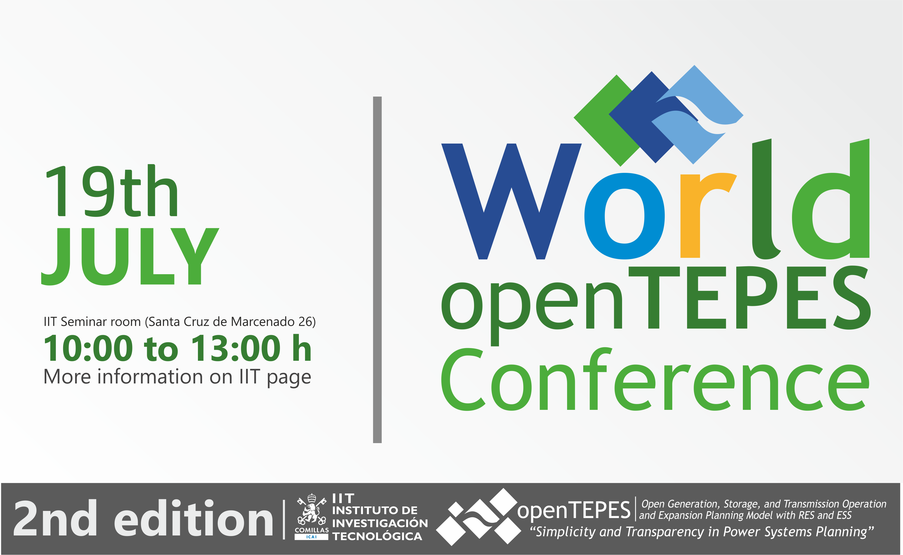

.. openTEPES documentation master file, created by Andres Ramos

Publications
=================
The **openTEPES** model has been used in these publications:

- E.F. Álvarez, J.C. López, L. Olmos, A. Ramos "An Optimal Expansion Planning of Power Systems Considering Cycle-Based AC Optimal Power Flow" Sustainable Energy, Grids and Networks, May 2024. `10.1016/j.segan.2024.101413 <https://doi.org/10.1016/j.segan.2024.101413>`_

- D. Santos-Oliveira, J. Lecarpentier, S. Lumbreras, L. Olmos, A. Ramos, M. Chammas, Th. Brouhard (2024) "The impact of EV penetration on the European Power System: the Tradeoffs in Storage" Social Science Research Network `10.2139/ssrn.4700642 <https://dx.doi.org/10.2139/ssrn.4700642>`_

- A. Ramos A, S. Huclin and J.P. Chaves (2023), "Analysis of different flexible technologies in the Spain NECP for 2030". Front. Built Environ. 9:1065998. `10.3389/fbuil.2023.1065998 <https://doi.org/10.3389/fbuil.2023.1065998>`_

- A. Ramos, E. Álvarez "Software implementation". *Second World openTEPES Conference*, July 2023. (`Presentation_2ndWorld_Sofware <https://pascua.iit.comillas.edu/aramos/papers/openTEPES_SoftwareImplementation.pdf>`_)

- A. Ramos, S. Huclin, J.P. Chaves "Analysis of different flexible technologies in the Spain NECP for 2030". *Second World openTEPES Conference*, July 2023. (`Presentation_2ndWorld_Spain_NECP_2030 <https://pascua.iit.comillas.edu/aramos/papers/SystemFlexibility.pdf>`_)

- E. Álvarez, L. Olmos, A. Ramos, K. Antoniadou-Plytaria, D. Steen, and L.A. Tuan "Values and Impacts of Incorporating Local Flexibility Services in Transmission Expansion Planning". *Second World openTEPES Conference*, July 2023. (`Presentation_2ndWorld_DER_TEP <https://pascua.iit.comillas.edu/aramos/papers/TSO-DSO_Presentation_openTEPESWorldConference_v2.pdf>`_)

- D. Oliviera, L. Olmos, A. Ramos, S. Lumbreras "Impact of the different EV charging strategies at European scale". *Second World openTEPES Conference*, July 2023.

- J.D. Gómez-Pérez, A. Ramos "Characterizing the Spanish hydro basins for their use in openTEPES". *Second World openTEPES Conference*, July 2023. (`Presentation_2ndWorld_hydro_basins <https://pascua.iit.comillas.edu/aramos/papers/Characterizing_Spanish_hydro_basins_openTEPES_openTEPESWorldConference.pdf>`_)

- S. Gómez, A. Ramos, M. Rivier, T. Freire "Role of openTEPES in the FlexEner project". *Second World openTEPES Conference*, July 2023. (`Presentation_2ndWorld_FlexEner <https://pascua.iit.comillas.edu/aramos/papers/Presentation_openTEPESWorldConference_SGS.pdf>`_)

- P. Linares, J.P. Chaves, J. García, J.F. Gutiérrez, A. Ramos, J.J. Valentín "How much storage do we need for the energy transition?". *Second World openTEPES Conference*, July 2023. (`Presentation_2ndWorld_storage_need <https://pascua.iit.comillas.edu/aramos/papers/Linares_etal_openTEPESWorldConference.pdf>`_)

- A. Ramos "Ayudando en los estudios eléctricos para hacer la transición energética". OptiMad 2023, Mayo 2023. (`Presentation_OptiMad <https://pascua.iit.comillas.edu/aramos/papers/OptiMad_openTEPES.pdf>`_)

- J.J. Valentín, J.P. Chaves, P. Linares, A. Ramos "`Análisis de las necesidades de almacenamiento eléctrico de España en el horizonte 2030 <https://www.funcas.es/wp-content/uploads/2023/01/PEE-174_Valentin_Chaves_Linares_Ramos.pdf>`_". Papeles de Energía 174, 72-91, Diciembre 2022.

- S. Huclin et al. "`Exploring the roles of storage technologies in the Spanish electricity system with high share of renewable energy <https://www.sciencedirect.com/science/article/pii/S2352484722005881/pdfft?md5=ff70ec78ff957bd32a1ded165aa77369&pid=1-s2.0-S2352484722005881-main.pdf>`_"
  *Energy Reports* 8: 4041-4057, November 2022. `10.1016/j.egyr.2022.03.032 <https://doi.org/10.1016/j.egyr.2022.03.032>`_

- E.F. Alvarez, L. Olmos, A. Ramos, K. Antoniadou-Plytaria, D. Steen, and L.A. Tuan "`Values and Impacts of Incorporating Local Flexibility Services in Transmission Expansion Planning <https://www.sciencedirect.com/science/article/pii/S0378779622005958/pdfft?md5=3f3561c0e3e0ba68aaf3d25ccdd2ac8f&pid=1-s2.0-S0378779622005958-main.pdf>`_"
  *Electric Power Systems Research* 212, July 2022. `10.1016/j.epsr.2022.108480 <https://doi.org/10.1016/j.epsr.2022.108480>`_

- E.F. Alvarez, L. Olmos, A. Ramos, K. Antoniadou-Plytaria, D. Steen, and L.A. Tuan "`Values and Impacts of Incorporating Local Flexibility Services in Transmission Expansion Planning - PSCC2024 <https://pscc.epfl.ch/rms/modules/request.php?module=oc_program&action=view.php&id=1731&file=1/1731.pdf>`_"
  *PSCC 2022*. Porto, Portugal. June 2022.

- A. Ramos, E. Quispe, S. Lumbreras "`OpenTEPES: Open-source Transmission and Generation Expansion Planning <https://www.sciencedirect.com/science/article/pii/S235271102200053X/pdfft?md5=ece8d3328c853a4795eda29acd2ad140&pid=1-s2.0-S235271102200053X-main.pdf>`_"
  *SoftwareX* 18: June 2022. `10.1016/j.softx.2022.101070 <https://doi.org/10.1016/j.softx.2022.101070>`_

- A. Ramos, S. Huclin, J.P. Chaves "Analysis of different storage technologies in the Spain NECP for 2030" *IEA Wind Task 25 Spring 2022 meeting*. May 2022.
  (`Presentation_2ndWorld_ <https://pascua.iit.comillas.edu/aramos/papers/StorageTechnologies.pdf>`_)

- A. Ramos, E. Alvarez "openTEPES" *First openTEPES World Conference*. March 2022. (`Presentation_1stWorld_openTEPES <https://pascua.iit.comillas.edu/aramos/papers/openTEPES.pdf>`_)

- A. Ramos "Assessing the operational flexibility provided by energy storage systems. The Spanish system in 2030" *IEA Wind Task 25 Spring 2021 meeting*. April 2021.
  (`Presentation_IEA_Wind <https://pascua.iit.comillas.edu/aramos/papers/AssessingESSFlexibility.pdf>`_)

- A. Ramos, S. Huclin, J.P. Chaves "Which role will play the pumped-storage hydro and the batteries in the future Spanish system: a case study" *IEEE Sustainable Power & Energy Conference iSPEC 2020*.
  Chengdu, Sichuan (China). November 2020. (`Presentation_IEEE_iSPEC <https://pascua.iit.comillas.edu/aramos/papers/Flexibility_iSPEC_China.pdf>`_)
