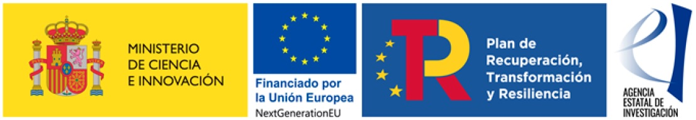

.. openTEPES documentation master file, created by Andres Ramos

Research projects
=================
The model has being used in these research projects:

- `Electricity Market Modelling <https://www.iit.comillas.edu/publicacion/proyecto/en/REPSOL_PRED_PRECIOS/Modelado_del_mercado_el%c3%a9ctrico>`_, developed for **Repsol**.
  November 2023 - April 2024. `L. Olmos <https://www.iit.comillas.edu/people/olmos>`_, `A. Ramos <https://www.iit.comillas.edu/people/aramos>`_, `S. Gómez Sánchez <https://www.iit.comillas.edu/people/sgomez>`_

    It aims to develop a tool focused on determining the evolution of prices in the Spanish peninsular electricity system electricity market in the 2023 to 2050 horizon.

- `Day-ahead market price simulation tool (HESIME) <https://www.iit.comillas.edu/publicacion/proyecto/en/HESIME/Herramienta_para_la_simulaci%c3%b3n_del_precio_del_mercado_diario_a_futuro>`_, developed for the **Ministry of Science and Innovation/State Research Agency** (10.13039/501100011033) under the program **Public-Private Partnerships** with **NextGenerationEU/PRTR** funds (CPP2022-009809). April 2023 - March 2026.
  `L. Olmos <https://www.iit.comillas.edu/people/olmos>`_, `A. Ramos <https://www.iit.comillas.edu/people/aramos>`_, `S. Gómez Sánchez <https://www.iit.comillas.edu/people/sgomez>`_

- `Open Modelling Toolbox for development of long-term pathways for the energy system in Africa (OpenMod4Africa) <https://openmod4africa.eu/>`_, developed for the **European Union**. July 2023 - June 2026.
  `L. Olmos <https://www.iit.comillas.edu/people/olmos>`_, `S. Lumbreras <https://www.iit.comillas.edu/people/slumbreras>`_, `A. Ramos <https://www.iit.comillas.edu/people/aramos>`_, `M.A.E. Elabbas <https://www.iit.comillas.edu/people/mabbas>`_

    It aims to develop an open toolbox populated with state-of-the-art models for analysing long-term pathways to sustainable, secure and competitive energy systems in Africa.
    The Toolbox will build on EU projects like openENTRANCE, Plan4RES and FocusAfrica, and will adapt and further develop open models in accordance with the African context and needs.
    The models are scalable, and can be applied to cities, industries and countries. Furthermore, a main objective for OpenMod4Africa is capacity building among energy models in academia.
    Four African universities will be actively involved in adapting models and conducting two regional case studies. The additional capacity and the open Toolbox will enable the universities
    to train new generations of energy modelling experts for the energy industries in Africa.

- `Highly-efficient and flexible integration of biomass and renewable hydrogen for low-cost combined heat and power generation to the energy system (Bio-FlexGen) <https://bioflexgen.eu/>`_, developed for the **European Union**. September 2021 - August 2024.
  `J.P. Chaves <https://www.iit.comillas.edu/people/jchaves>`_, `A. Ramos <https://www.iit.comillas.edu/people/aramos>`_, `J.F. Gutierrez <https://www.iit.comillas.edu/people/jgutierrez>`_

    It aims to significantly increase the efficiency, flexibility and cost effectiveness of renewable energy-based combined heat and power plants (CHP),
    enabling them to play a key role in integrating fluctuating renewable energy into the energy system, and therefore making a significant contribution to the decarbonization of the energy system.

- `Analysis of the role of pumped-hydro storage power plants in the Spanish NECP 2030 <https://www.iit.comillas.edu/proyectos/mostrar_proyecto.php.en?nombre_abreviado=IBD_PNIEC_Bbo>`_, developed for **Iberdrola**.
  July 2023 - October 2023. `A. Ramos <https://www.iit.comillas.edu/people/aramos>`_, `P. Linares <https://www.iit.comillas.edu/people/pedrol>`_, `J.P. Chaves <https://www.iit.comillas.edu/people/jchaves>`_, `M. Rivier <https://www.iit.comillas.edu/people/michel>`_, `T. Gómez <https://www.iit.comillas.edu/people/tomas>`_

    It aims to evaluate the role pumped-hydro storage power plants in the Spanish NECP 2030.

- `Support in the preparation of the application to the call on innovative energy storage systems <https://www.iit.comillas.edu/proyectos/mostrar_proyecto.php.en?nombre_abreviado=GlideEnergySoporteProyectosAlmacenamiento>`_, developed for **Glide Energy**.
  June 2023 - October 2023. `L. Rouco <https://www.iit.comillas.edu/people/rouco>`_, `A. Ramos <https://www.iit.comillas.edu/people/aramos>`_, `F.M. Echavarren <https://www.iit.comillas.edu/people/pacoec>`_, `R. Cossent <https://www.iit.comillas.edu/people/rcossent>`_

    It is aimed at supporting Glide Energy in the preparation of the application to the call of the Spanish Ministry of Ecological Transition on innovative energy storage systems.

- `Analysis of the technical and economic benefits of solar thermal generation in the Spanish peninsular system <https://www.iit.comillas.edu/proyectos/mostrar_proyecto.php.en?nombre_abreviado=ProTermosolar_Presentacion>`_, developed for **ProTermosolar**.
  March 2023. `A. Ramos <https://www.iit.comillas.edu/people/aramos>`_, `L. Sigrist <https://www.iit.comillas.edu/people/lsigrist>`_

    It aims to write a presentation on the quantitative analysis of the technical and economic impact of solar thermal in the operation of the Spanish peninsular system.

- Hydro generation advanced systems: modeling, control, and optimized integration to the system (AVANHID), developed for the **Ministry of Science and Innovation/State Research Agency** (10.13039/501100011033) under the program **Public-Private Partnerships** with **NextGenerationEU/PRTR** funds (CPP2021-009114). December 2022 - November 2025.
  `A. Ramos <https://www.iit.comillas.edu/people/aramos>`_, `J.M. Latorre <https://www.iit.comillas.edu/people/jesuslc>`_, `P. Dueñas <https://www.iit.comillas.edu/people/pduenas>`_, `L. Rouco <https://www.iit.comillas.edu/people/rouco>`_, `L. Sigrist <https://www.iit.comillas.edu/people/lsigrist>`_, `I. Egido <https://www.iit.comillas.edu/people/egido>`_, `J.D. Gómez Pérez <https://www.iit.comillas.edu/people/jdgomez>`_, `F. Labora <https://www.iit.comillas.edu/people/flabora>`_

- Local markets for energy communities: designing efficient markets and assessing the integration from the electricity system perspective (OptiREC), developed for the **Ministry of Science and Innovation/State Research Agency** (10.13039/501100011033) under the program **Strategic projects oriented to the ecological transition and digital transition** with **NextGenerationEU/PRTR** funds (TED2021-131365B-C43). December 2022 - July 2025.
  `A. Ramos <https://www.iit.comillas.edu/people/aramos>`_, `J.P. Chaves <https://www.iit.comillas.edu/people/jchaves>`_, `J.M. Latorre <https://www.iit.comillas.edu/people/jesuslc>`_, `J. García <https://www.iit.comillas.edu/people/javiergg>`_, `M. Troncia <https://www.iit.comillas.edu/people/mtroncia>`_, `S.A. Mansouri <https://www.iit.comillas.edu/people/smansouri>`_, `O.M. Valarezo <https://www.iit.comillas.edu/people/ovalarezo>`_, `M. Mohammed <https://www.iit.comillas.edu/people/mmohammed>`_

- `Delivering the next generation of open Integrated Assessment MOdels for Net-zero, sustainable Development (DIAMOND) <https://climate-diamond.eu/>`_, developed for the **European Union**. October 2022 - August 2025.
  `S. Lumbreras <https://www.iit.comillas.edu/people/slumbreras>`_, `L. Olmos <https://www.iit.comillas.edu/people/olmos>`_, `A. Ramos <https://www.iit.comillas.edu/people/aramos>`_

    It will update, upgrade, and fully open six IAMs that are emblematic in scientific and policy processes, improving their sectoral and technological detail, spatiotemporal resolution, and geographic granularity.
    It will further enhance modelling capacity to assess the feasibility and desirability of Paris-compliant mitigation pathways, their interplay with adaptation, circular economy, and other SDGs,
    their distributional and equity effects, and their resilience to extremes, as well as robust risk management and investment strategies.

.. image:: ../img/DIAMOND_prj.jpg
   :scale: 20%
   :align: center

- `Application of the ENTSO-e cost-benefit analysis method to Aguayo II pumped-hydro storage <https://www.iit.comillas.edu/proyectos/mostrar_proyecto.php.en?nombre_abreviado=Repsol_AguayoII>`_, developed for **Repsol**.
  June 2022. `A. Ramos <https://www.iit.comillas.edu/people/aramos>`_, `L. Olmos <https://www.iit.comillas.edu/people/olmos>`_, `L. Sigrist <https://www.iit.comillas.edu/people/lsigrist>`_

    It aims to write a report on the application of the ENTSO-e cost-benefit analysis method to Aguayo II pumped-hydro storage.

- `Application of the ENTSO-e cost-benefit analysis method to Los Guájares pumped-hydro storage <https://www.iit.comillas.edu/proyectos/mostrar_proyecto.php.en?nombre_abreviado=VMEnergia_LosGuajares>`_, developed for **VM Energía**.
  May 2022 - June 2022. `A. Ramos <https://www.iit.comillas.edu/people/aramos>`_, `L. Olmos <https://www.iit.comillas.edu/people/olmos>`_, `L. Sigrist <https://www.iit.comillas.edu/people/lsigrist>`_

    It aims to write a report on the application of the ENTSO-e cost-benefit analysis method to Los Guájares pumped-hydro storage.

- `Impact of the electric vehicle in the electricity markets in 2030 <https://www.iit.comillas.edu/proyectos/mostrar_proyecto.php.en?nombre_abreviado=REPSOL_VE>`_, developed for **Repsol**.
  November 2021 - February 2022. `A. Ramos <https://www.iit.comillas.edu/people/aramos>`_, `P. Frías <https://www.iit.comillas.edu/people/pablof>`_, `J.P. Chaves <https://www.iit.comillas.edu/people/jchaves>`_,
  `P. Linares <https://www.iit.comillas.edu/people/pedrol>`_, `J.J. Valentín <https://www.iit.comillas.edu/people/jjvalentin>`_

    It aims to analyze the impact on the electricity markets of the mainland Spanish system of the high penetration of electric vehicles in a 2030 scenario.

- `European Climate and Energy Modelling Forum (ECEMF) <https://ecemf.eu/>`_, developed for the **European Union**.
  May 2021 - December 2024.
  `S. Lumbreras <https://www.iit.comillas.edu/people/slumbreras>`_, `A. Ramos <https://www.iit.comillas.edu/people/aramos>`_, `L. Olmos <https://www.iit.comillas.edu/people/olmos>`_,
  `C. Mateo <https://www.iit.comillas.edu/people/cmateo>`_, `D. Santos Oliveira <https://www.iit.comillas.edu/people/doliveira>`_, `M.S. Gómez Pérez <https://www.iit.comillas.edu/people/mgomezp>`_

    It aims to provide the knowledge to inform the development of future energy and climate policies at national and European levels. In support of this aim, ECEMF proposes a range of activities to achieve five objectives and meet the four challenges set out in the call text.
    ECEMF’s programme of events and novel IT-based communications channel will enable researchers to identify and co-develop the most pressing policy-relevant research questions with a range of stakeholders to meet ambitious European energy and climate policy goals,
    in particular the European Green Deal and the transformation to a climate neutral society.

- `Assessment of the storage needs for the Spanish electric system in a horizon 2020-2050 with large share of renewables <https://www.iit.comillas.edu/proyectos/mostrar_proyecto.php.en?nombre_abreviado=IDAE_Almacenamiento>`_, developed for
  the **Instituto para la Diversificación y Ahorro de la Energía (IDAE)**. January 2021 - June 2022.
  `A. Ramos <https://www.iit.comillas.edu/people/aramos>`_, `P. Linares <https://www.iit.comillas.edu/people/pedrol>`_, `J.P. Chaves <https://www.iit.comillas.edu/people/jchaves>`_,
  `J. García <https://www.iit.comillas.edu/people/javiergg>`_, `S. Wogrin <https://www.iit.comillas.edu/people/swogrin>`_, `J.J. Valentín <https://www.iit.comillas.edu/people/jjvalentin>`_

    It aims to assess, from a technical and economic point of view, the daily, weekly, and seasonal storage needs for the Spanish electricity system in the 2020-2050 horizon.

- `FlexEner. New 100% renewable, flexible and robust energy system for the integration of new technologies in generation, networks and demand - Scenarios <https://www.iit.comillas.edu/proyectos/mostrar_proyecto.php.en?nombre_abreviado=FLEXENER_IBD-GEN_ESCENARIOS>`_, developed for **Iberdrola** under **Misiones CDTI 2019** program (MIG-20201002).
  October 2020 - December 2023.
  `M. Rivier <https://www.iit.comillas.edu/people/michel>`_, `T. Gómez <https://www.iit.comillas.edu/people/tomas>`_, `A. Sánchez <https://www.iit.comillas.edu/people/alvaro>`_,
  `F. Martín <https://www.iit.comillas.edu/people/fmartin>`_, `A. Ramos <https://www.iit.comillas.edu/people/aramos>`_, `J.P. Chaves <https://www.iit.comillas.edu/people/jchaves>`_,
  `S. Gómez Sánchez <https://www.iit.comillas.edu/people/sgomez>`_, `L. Herding <https://www.iit.comillas.edu/people/lherding>`_, `T. Freire <https://www.iit.comillas.edu/people/tfreire>`_

    It aims to investigate new technologies and simulation models in the field of renewable generation, storage systems and flexible demand management and operation of the distribution network.
    A 100% renewable and decarbonised energy mix is sought, effectively integrated into the electrical system of the future in a flexible, efficient and safe way.

- `Improving energy system modelling tools and capacity <https://www.iit.comillas.edu/proyectos/mostrar_proyecto.php.en?nombre_abreviado=REFORMS>`_, developed for the **European Commission**.
  October 2020 - June 2022.
  `S. Lumbreras <https://www.iit.comillas.edu/people/slumbreras>`_, `A. Ramos <https://www.iit.comillas.edu/people/aramos>`_, `P. Linares <https://www.iit.comillas.edu/people/pedrol>`_, `D. Santos <https://www.iit.comillas.edu/people/doliveira>`_,
  `M. Pérez-Bravo <https://www.iit.comillas.edu/people/mperezb>`_, `A.F. Rodríguez Matas <https://www.iit.comillas.edu/people/afrmatas>`_, `J.C. Romero <https://www.iit.comillas.edu/people/jcromero>`_

    It aims to improve the description of the Spanish energy system in model TIMES-SINERGIA, from the technologies considered or a higher time resolution to the detailed modeling of the power sector, such as the inclusion of transmission constraints, with openTEPES.

- `MODESC – Platform of innovative models for speeding the energy transition towards a decarbonized economy <https://www.iit.comillas.edu/proyectos/mostrar_proyecto.php.en?nombre_abreviado=MODESC_RETOS>`_, developed for the **Ministry of Science and Innovation** under **Retos Colaboración 2019** program (RTC2019-007315-3).
  September 2020 - December 2023.
  `T. Gómez <https://www.iit.comillas.edu/people/tomas>`_, `M. Rivier <https://www.iit.comillas.edu/people/michel>`_, `J.P. Chaves <https://www.iit.comillas.edu/people/jchaves>`_,
  `A. Ramos <https://www.iit.comillas.edu/people/aramos>`_, `P. Linares <https://www.iit.comillas.edu/people/pedrol>`_, `F. Martín <https://www.iit.comillas.edu/people/fmartin>`_,
  `L. Herding <https://www.iit.comillas.edu/people/lherding>`_

    It aims to develop of a global platform that integrates innovative energy simulation and impact assessment models that allow speeding the decarbonization of the electricity system including the electrification of the energy demand.

- `Open ENergy TRansition ANalyses for a low-carbon Economy (openENTRANCE) <https://openentrance.eu/>`_, developed for the **European Union**. May 2019 - June 2023.
  `L. Olmos <https://www.iit.comillas.edu/people/olmos>`_, `S. Lumbreras <https://www.iit.comillas.edu/people/slumbreras>`_, `A. Ramos <https://www.iit.comillas.edu/people/aramos>`_,
  `E. Alvarez <https://www.iit.comillas.edu/people/ealvarezq>`_

    It aims to develop, use, and disseminate an open, transparent and integrated modelling platform for assessing low-carbon transition pathways in Europe.

.. image:: ../img/open-entrance_logo.png
   :scale: 40%
   :align: center

- `Analysis of the expansion and operation of the Spanish electricity system for a 2030-2050 time horizon <https://www.iit.comillas.edu/proyectos/mostrar_proyecto.php.en?nombre_abreviado=IBD_ANALISIS_H2030-50>`_, developed for **Iberdrola**.
  January 2019 - December 2021. `M. Rivier <https://www.iit.comillas.edu/people/michel>`_, `T. Gómez <https://www.iit.comillas.edu/people/tomas>`_, `A. Sánchez <https://www.iit.comillas.edu/people/alvaro>`_,
  `F. Martín <https://www.iit.comillas.edu/people/fmartin>`_, `T. Freire <https://www.iit.comillas.edu/people/tfreire>`_, `J.P. Chaves <https://www.iit.comillas.edu/people/jchaves>`_, `T. Gerres <https://www.iit.comillas.edu/people/tgerres>`_,
  `S. Huclin <https://www.iit.comillas.edu/people/shuclin>`_, `A. Ramos <https://www.iit.comillas.edu/people/aramos>`_

    It aims to evaluate the potential and role that each generation, storage and consumption technology can play in the future mix of the Spanish electricity system.
